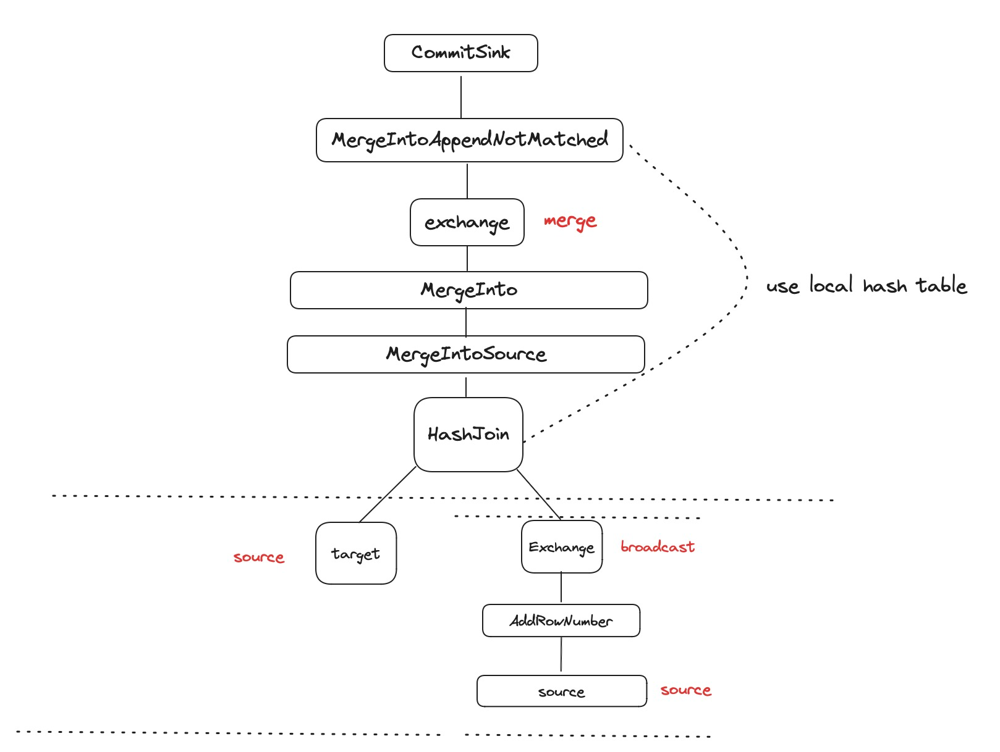

[Databend](https://github.com/datafuselabs/databend) is a modern cloud data warehouse, serving your massive-scale analytics needs at low cost and complexity. Open source alternative to Snowflake. Also available in the cloud: <https://app.databend.com> .

## What's New

Stay informed about the latest features of Databend.

### MERGE INTO now Supports Distributed Execution

The `MERGE INTO` statement performs insert, update, or delete operations on rows in the target table based on specified conditions and matching criteria using data from the specified source.

MERGE INTO has been enhanced to support distributed execution. The physical plan for distributed execution is shown as follows.

Please [contact the Databend team](https://www.databend.com/contact-us) if you would like to learn more, or check out the resources below:

- [PR #13151 | feat: support distributed merge_into](https://github.com/datafuselabs/databend/pull/13151)

## Code Corner

Discover some fascinating code snippets or projects that showcase our work or learning journey.

### Incorporate Data Version Control into Your Analytics Workflow with LakeFS

LakeFS provides a solution for sharing and collaborating on data processing by empowering object storage with Git-like operations. It offers a versioning scheme that provides logically consistent views of data, meaningful branch names, and commit messages for modern data workflows, as well as integrated solutions for data and document unification.

Databend not only provides a distributed, elastic, and scalable query engine with high performance but also supports multi-version storage similar to Git. This allows for easy querying, cloning, and restoring of data at any point in time.

By combining LakeFS's data versioning capabilities with Databend's Git-like data management capabilities, data integrity can be ensured, and efficient and highly available consistent views can be provided for data analysis workflows.

If you are interested in learning more, please check out the resources below:

- [Blog | Incorporate Data Version Control into Your Analytics Workflow](https://databend.rs/blog/2023-11-02-databend-with-lakefs)

## Highlights

We have also made these improvements to Databend that we hope you will find helpful:

- Introduced new [JSON operators](https://databend.rs/doc/sql-commands/query-operators/json/): `?`, `?|`, and `?&`.
- Added support for permissions management on `STAGE` and `UDF`.
- Introduced new table function [FLATTEN](https://databend.rs/doc/sql-functions/semi-structured-functions/flatten).
- Added support for creating external tables using URLs: `CREATE STAGE test_stage [URL=] 's3://load/files/'`.
- Read the documentation [Example 2: Attaching Table in READ_ONLY Mode](https://databend.rs/doc/sql-commands/ddl/table/attach-table#example-2-attaching-table-in-read_only-mode) to learn how to use `ATTACH TABLE` in read-only mode.
- Read the documentation [Conversion Functions](https://databend.rs/doc/sql-functions/conversion-functions/) to learn about type conversion functions and rules in Databend.

## What's Up Next

We're always open to cutting-edge technologies and innovative ideas. You're more than welcome to join the community and bring them to Databend.

### Support for Reading Delta Lake

After successfully incorporating support for mounting and reading data from Iceberg tables through the Catalog, Databend is gearing up for adding compatibility with Delta Lake.

Delta Lake, initiated and open-sourced by Databricks, is a storage format that extends Parquet data files with file-based transaction logs, enabling ACID transactions and scalable metadata handling. Delta Lake is fully compatible with Apache Spark APIs and tightly integrated with structured streaming, allowing you to easily use a single data copy in both batch and streaming operations while providing large-scale incremental processing.

[Issue #13429 | add read only support for Delta table ](https://github.com/datafuselabs/databend/issues/13429)

Please let us know if you're interested in contributing to this feature, or pick up a good first issue at <https://link.databend.rs/i-m-feeling-lucky> to get started.

## New Contributors

We always open arms to everyone and can't wait to see how you'll help our community grow and thrive.

* [@guojidan](https://github.com/guojidan) added new filter parameters for the SHOW commands in [#13510](https://github.com/datafuselabs/databend/pull/13510).

## Changelog

You can check the changelog of Databend Nightly for details about our latest developments.

**Full Changelog**: <https://github.com/datafuselabs/databend/compare/v1.2.174-nightly...v1.2.183-nightly>
