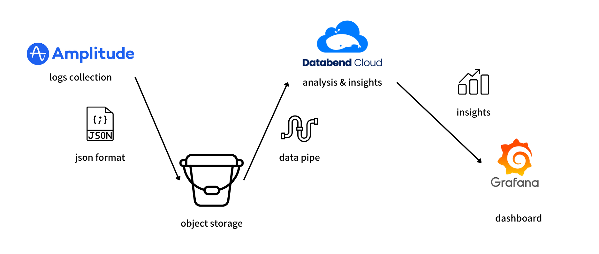

[Databend](https://github.com/datafuselabs/databend) is a modern cloud data warehouse, serving your massive-scale analytics needs at low cost and complexity. Open source alternative to Snowflake. Also available in the cloud: <https://app.databend.com> .

## What's New

Stay informed about the latest features of Databend.

### User Case: Databend Cloud Helped AIGC Startup Reduce Cost

Databend Cloud is an easy-to-use, low-cost, high-performance next-gen big data analytics platform built on the open-source cloud-native data warehouse project Databend.

By using Databend Cloud for analytics, the startup reduced their user behavior log analysis costs to 1% of their previous solution.



Databend Cloud did an excellent job assisting with user behavior analysis and providing insights into root causes.

- Monthly analysis and dashboard costs dropped by 100x.
- Raw data is stored in the customer's own object storage for further compliance check.
- Databend Cloud's excellent capacities for handling semi-structured data and complex queries perfectly matched the customer's business requirements and facilitated the migration of their analytics jobs to Databend Cloud.

If you want to learn more, please feel free to contact the [Databend team](https://databend.com/contact-us/), or check out the resources listed below.

- [Blog | Databend Cloud Helped AIGC Startup Reduce Cost](https://www.databend.com/blog/down-costs-for-aigc-startup/)

## Code Corner

Discover some fascinating code snippets or projects that showcase our work or learning journey.

### databend-udf Released, Databend Cloud Officially Supports External Functions

Databend supports creating UDFs using programming languages you are familiar with to customize data processing workflows and integrate into data analysis workflows.

Currently, Databend has packaged and released the Python SDK `databend-udf` to PyPI, for users to easily define and implement Python-based UDFs. We will also provide SDK support in more languages in the future, stay tuned. 

In addition, Databend Cloud now also supports external UDFs. If you want to try it out, please contact us by creating a ticket and provide the UDF server address.

For more information, please check out the resources below.

- [Docs | External Function](https://databend.rs/doc/sql-commands/ddl/external-function/)
- [databend-udf · PyPI](https://pypi.org/project/databend-udf/)

## Highlights

We have also made these improvements to Databend that we hope you will find helpful:

- Introduced `translate` function.
- Added support for `task_history` system table.
- `MERGE INTO` now supports using table directly as a data source. 
- `SHOW DROP TABLE` now supports filtering and `LIMIT` options.

## What's Up Next

We're always open to cutting-edge technologies and innovative ideas. You're more than welcome to join the community and bring them to Databend.

### New Function: CURRENT_TIMESTAMP

The `CURRENT_TIMESTAMP` function returns the current date and time, with an optional precision parameter to control the number of digits after the decimal point in the output.


```SQL
SELECT CURRENT_TIMESTAMP(2);

+------------------------+
| CURRENT_TIMESTAMP(2)   |
|------------------------|
| 2023-11-12 10:23:18.35 |
+------------------------+

SELECT CURRENT_TIMESTAMP();

+-------------------------------+
| CURRENT_TIMESTAMP             |
|-------------------------------|
| 2023-11-12 10:25:27.358000000 |
+-------------------------------+
```

[Issue #13689 | Feature: support function: CURRENT_TIMESTAMP](https://github.com/datafuselabs/databend/issues/13689)

Please let us know if you're interested in contributing to this feature, or pick up a good first issue at <https://link.databend.rs/i-m-feeling-lucky> to get started.

## Changelog

You can check the changelog of Databend Nightly for details about our latest developments.

**Full Changelog**: <https://github.com/datafuselabs/databend/compare/v1.2.193-nightly...v1.2.206-nightly>
