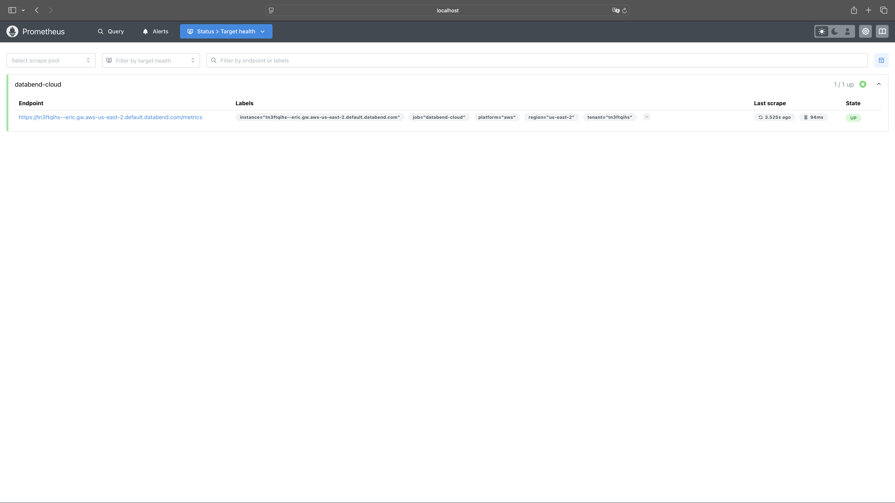
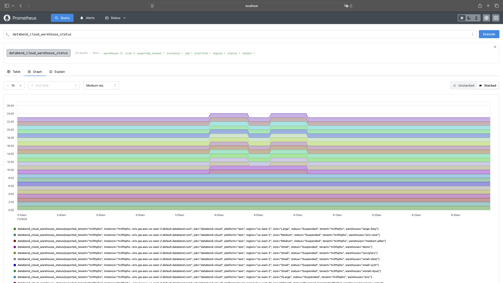

import StepsWrap from '@site/src/components/StepsWrap';
import StepContent from '@site/src/components/Steps/step-content';

[Prometheus](https://prometheus.io/) 提供了一个强大的实时监控解决方案，使您能够有效地跟踪关键指标并保持系统稳定性。本主题将指导您完成将 Prometheus 与 Databend Cloud 集成的步骤，并概述可用的指标。

:::note
使用 Prometheus 追踪指标仅适用于 Databend Cloud 中 业务版 和 独享版 的用户。
:::

## 与 Prometheus 集成

按照以下步骤设置一个带有 Docker 的 Prometheus 实例，并将其与 Databend Cloud 集成：

<StepsWrap>
<StepContent number="1">

### 前提条件

- 要开始追踪指标，请确保为您的 Databend Cloud 租户启用了指标。要启用此功能，请在 Databend Cloud 中提交支持工单，方法是导航到 **支持** > **创建新工单**，并请求为您的租户激活指标。

- 此过程说明了如何使用 Docker 设置 Prometheus 实例。在继续之前，请确保您的机器上已安装 Docker Engine。

</StepContent>
<StepContent number="2">

### 准备一个 SQL 用户

在 Databend Cloud 中创建一个专用的 SQL 用户，供 Prometheus 访问指标。例如，您可以使用以下 SQL 语句创建一个名为 `metrics`，密码为 `metrics_password` 的 SQL 用户：

```sql
CREATE USER metrics IDENTIFIED BY 'metrics_password';
```

</StepContent>
<StepContent number="3">

### 使用 Docker 启动 Prometheus

1. 在您的本地机器上，创建一个名为 **prometheus.yml** 的文件，以配置 Prometheus 从 Databend Cloud 抓取指标。使用以下模板：

```yaml title='prometheus.yml'
scrape_configs:
  - job_name: databend-cloud
    scheme: https
    metrics_path: /metrics
    basic_auth:
      username: <USERNAME>
      password: <PASSWORD>
    scrape_interval: 10s
    scrape_timeout: 3s
    static_configs:
      - targets:
          - <TENANT_ENDPOINT>
        labels: # Optional
          tenant: <TENANT_ID>
          platform: <PLATFORM>
          region: <REGION>
```

| 占位符              | 描述                                           | 示例                                                |
| -------------------- | ---------------------------------------------- | --------------------------------------------------- |
| `<USERNAME>`         | SQL 用户的用户名。                             | `metrics`                                           |
| `<PASSWORD>`         | SQL 用户的安全密码。                             | `metrics_password`                                  |
| `<TENANT_ENDPOINT>`  | 您的 Databend Cloud 租户的端点 URL。             | `tnxxxxxxx.gw.aws-us-east-2.default.databend.com`  |
| `<TENANT_ID>`        | 您的租户的唯一标识符。                           | `tnxxxxxxx`                                         |
| `<PLATFORM>`         | 托管租户的云平台。                             | `aws`                                               |
| `<REGION>`           | 租户所在的区域。                               | `us-east-2`                                         |

2. 使用以下命令启动 Prometheus（将 `</path/to/prometheus.yml>` 替换为您的 **prometheus.yml** 文件的完整路径）：

```bash
docker run -d \
  --name prometheus \
  -p 9090:9090 \
  -v </path/to/prometheus.yml>:/etc/prometheus/prometheus.yml \
  prom/prometheus
```

3. 在浏览器中打开 Prometheus，地址为 `http://localhost:9090`，导航到 **Status** > **Target health**，并确认 `databend-cloud` 目标已列出，状态为 `UP`。



</StepContent>
</StepsWrap>

一切就绪！您现在可以直接从 Prometheus 查询您的租户指标。例如，尝试查询 `databend_cloud_warehouse_status`：



## 可用指标列表

请注意，所有指标都以 `databend_cloud_` 为前缀。

:::note
这些指标处于 alpha 状态，可能会随时间而变化。我们建议您密切监控这些指标，并相应地调整您的监控设置。
:::

### 查询指标

以下是 Databend Cloud 中可用的查询指标列表：

| 名称                   | 类型    | 标签             | 描述                                |
| ---------------------- | ------- | ---------------- | ----------------------------------- |
| query_count            | Counter | tenant,warehouse | 客户端发出的查询计数                  |
| query_errors           | Counter | tenant,warehouse | 客户端发出的查询错误计数                |
| query_request_bytes    | Counter | tenant,warehouse | 来自客户端的查询请求字节数              |
| query_response_bytes   | Counter | tenant,warehouse | 发送到客户端的查询响应字节数            |

### 存储指标

以下是 Databend Cloud 中可用的存储指标列表：

| 名称                            | 类型  | 标签   | 描述                                             |
| ------------------------------- | ----- | ------ | ------------------------------------------------ |
| storage_total_size              | Guage | tenant | 后端对象存储的总大小                               |
| storage_staged_size             | Guage | tenant | 后端对象存储上暂存文件的总大小                       |
| storage_table_compressed_size   | Guage | tenant | 当前表后端对象存储的总大小                         |
| storage_non_current_size        | Guage | tenant | 后端存储中非当前对象的总大小                       |

### 计算集群 指标

以下是 Databend Cloud 中可用的 计算集群 指标列表：

| 名称                               | 类型    | 标签                           | 描述                                               |
| ---------------------------------- | ------- | ------------------------------ | -------------------------------------------------- |
| warehouse_status                   | Guage   | tenant,warehouse,size,status   | 计算集群 状态的标志（Suspended,Running 等）          |
| warehouse_connections              | Guage   | tenant,warehouse               | 当前会话数                                         |
| warehouse_queries_queued           | Guage   | tenant,warehouse               | 当前在队列中等待的查询                             |
| warehouse_queries_running          | Guage   | tenant,warehouse               | 当前正在运行的查询                                 |
| warehouse_queries_start_total      | Counter | tenant,warehouse               | 启动的查询总数                                     |
| warehouse_queries_failed_total     | Counter | tenant,warehouse               | 失败的查询总数                                     |
| warehouse_queries_success_total    | Counter | tenant,warehouse               | 成功的查询总数                                     |
| warehouse_storage_requests_total   | Counter | tenant,warehouse,scheme,op     | 后端存储的请求计数                                 |
| warehouse_storage_requests_bytes   | Counter | tenant,warehouse,scheme,op     | 来自后端存储的请求字节数                           |
| warehouse_data_scan_rows           | Counter | tenant,warehouse               | 从后端存储扫描的数据行数                           |
| warehouse_data_write_rows          | Counter | tenant,warehouse               | 写入后端存储的数据行数                             |

### 任务指标

以下是 Databend Cloud 中可用的任务指标列表：

| 名称                              | 类型    | 标签            | 描述                           |
| --------------------------------- | ------- | --------------- | ------------------------------ |
| task_scheduled_total              | Counter | tenant,task     | 计划任务总数                   |
| task_query_requests_total         | Counter | tenant,task     | 任务的查询请求                 |
| task_run_skipped_total            | Counter | tenant,task     | 跳过的任务运行                 |
| task_accessor_requests_total      | Counter | tenant,function | 任务的访问器请求               |
| task_notification_success_total   | Counter | tenant          | 成功的任务通知                 |
| task_notification_errors_total    | Counter | tenant          | 任务通知错误                   |
| task_running_duration_seconds     | Counter | tenant,task     | 任务运行持续时间（秒）         |
| task_running                      | Counter | tenant,task     | 正在运行的任务                 |
| task_scheduled_timestamp          | Counter | tenant,task     | 计划任务时间戳                 |