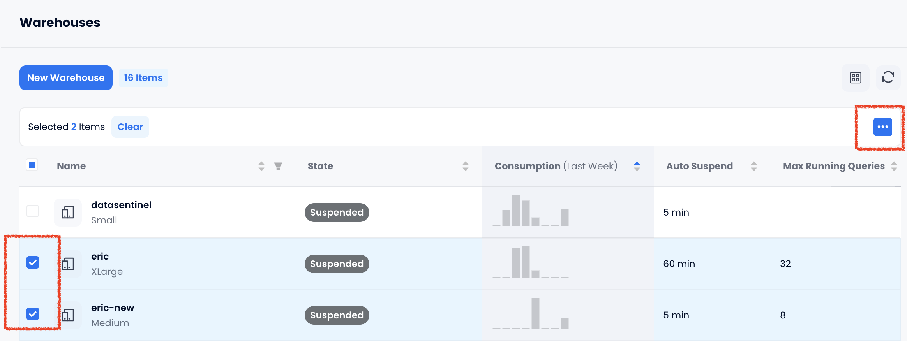

import PlaySVG from '@site/static/img/icon/play.svg'
import SuspendSVG from '@site/static/img/icon/suspend.svg'
import CheckboxSVG from '@site/static/img/icon/checkbox.svg'
import EllipsisSVG from '@site/static/img/icon/ellipsis.svg'
import  { Button } from 'antd'

计算集群是 Databend Cloud 的重要组成部分。一个计算集群代表了一组计算能力，包括 CPU、内存和本地缓存。您必须运行一个计算集群来执行 SQL 任务，例如：

- 使用 SELECT 语句查询数据
- 使用 INSERT、UPDATE 或 DELETE 语句修改数据
- 使用 COPY INTO 命令将数据加载到表中

运行计算集群会产生费用。有关更多信息，请参阅[计算集群定价](/guides/overview/editions/dc/pricing#warehouse-pricing)。

## 计算集群大小

在 Databend Cloud 中，计算集群有多种大小可供选择，每种大小由其包含的 vCPU 数量和可以处理的最大并发查询数量定义。创建计算集群时，您可以从以下大小中选择：

| 大小   | vCPUs | 最大运行查询数 |
|--------|-------|----------------|
| XSmall | 8     | 1-2            |
| Small  | 16    | 1-4            |
| Medium | 32    | 1-8            |
| Large  | 64    | 1-16           |
| XLarge | 128   | 1-32           |

为了选择合适的计算集群大小，Databend 建议从较小的尺寸开始。较小的计算集群在执行 SQL 任务时可能比中等或大型计算集群花费更长时间。如果您发现查询执行时间过长（例如，几分钟），请考虑升级到中等或大型计算集群以获得更快的查询结果。

## 管理计算集群 {#managing}

一个组织可以根据需要拥有任意数量的计算集群。**计算集群**页面显示了您组织中的所有计算集群，并允许您管理它们。请注意，只有 `account_admin` 可以创建或删除计算集群。

### 暂停/恢复计算集群

暂停的计算集群不会消耗任何信用额度。您可以通过点击计算集群上的 <SuspendSVG/> 或 <PlaySVG/> 按钮手动暂停或恢复计算集群。然而，在以下情况下，计算集群可以自动暂停或恢复：

- 如果计算集群没有活动，根据其自动暂停设置，计算集群可以自动暂停。
- 当您选择一个已暂停的计算集群来执行 SQL 任务时，计算集群将自动恢复。

### 执行批量操作

您可以对计算集群执行批量操作，包括批量重启、批量暂停、批量恢复和批量删除。为此，请通过在计算集群列表中勾选复选框 <CheckboxSVG/> 来选择要进行批量操作的计算集群，然后点击椭圆按钮 <EllipsisSVG/> 以执行所需的操作。

## 连接到计算集群 {#connecting}

连接到计算集群提供了在 Databend Cloud 中运行查询和分析数据所需的计算资源。当从您的应用程序或 SQL 客户端访问 Databend Cloud 时，此连接是必要的。

要获取计算集群的连接信息：

1. 点击**概览**页面上的 **连接**。
2. 选择您希望连接的数据库和计算集群。连接信息将根据您的选择进行更新。
3. 连接详细信息包括一个名为 `cloudapp` 的 SQL 用户，其密码是随机生成的。Databend Cloud 不存储此密码。请务必复制并安全地保存它。如果您忘记了密码，请点击 **重置** 以生成一个新密码。