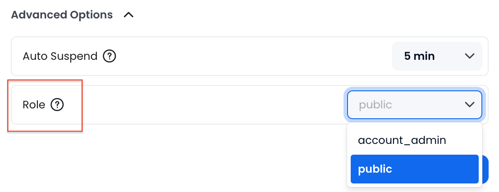

import PlaySVG from '@site/static/img/icon/play.svg'
import SuspendSVG from '@site/static/img/icon/suspend.svg'
import CheckboxSVG from '@site/static/img/icon/checkbox.svg'
import EllipsisSVG from '@site/static/img/icon/ellipsis.svg'
import { Button } from 'antd'

计算集群是 Databend Cloud 的一个重要组成部分。计算集群代表一组计算资源，包括 CPU、内存和本地缓存。您必须运行一个计算集群才能执行 SQL 任务，例如：

- 使用 SELECT 语句查询数据
- 使用 INSERT、UPDATE 或 DELETE 语句修改数据
- 使用 COPY INTO 命令将数据加载到表中

运行计算集群会产生费用。有关更多信息，请参见 [计算集群定价](/guides/products/dc/pricing#warehouse-pricing)。

## 计算集群大小

在 Databend Cloud 中，计算集群有多种大小可供选择，每种大小都由它可以处理的最大并发查询数定义。创建计算集群时，您可以从以下大小中进行选择：

| 大小                  | 推荐使用场景                                                                                                                            |
| --------------------- | ------------------------------------------------------------------------------------------------------------------------------------------------ |
| XSmall                | 最适合简单的任务，如测试或运行轻量级查询。适用于小型数据集（约 50GB）。                                          |
| Small                 | 非常适合运行常规报告和中等工作负载。适用于中型数据集（约 200GB）。                                     |
| Medium                | 适合处理更复杂的查询和更高并发的团队。适用于大型数据集（约 1TB）。                                 |
| Large                 | 非常适合运行许多并发查询的组织。适用于大型数据集（约 5TB）。                                             |
| XLarge                | 专为具有高并发的企业级工作负载而构建。适用于非常大的数据集（超过 10TB）。                                        |
| Multi-Cluster Scaling | 自动扩展和缩减以匹配您的工作负载，从而提供最具成本效益的方式来根据您的需求提高并发性。 |

要选择合适的计算集群大小，Databend 建议从较小的尺寸开始。与中型或大型计算集群相比，较小的计算集群可能需要更长的时间来执行 SQL 任务。如果您发现查询执行时间过长（例如，几分钟），请考虑扩展到中型或大型计算集群以获得更快的结果。

## 管理计算集群 {#managing}

一个组织可以根据需要拥有任意数量的计算集群。“计算集群”页面显示您组织中的所有计算集群，并允许您管理它们。请注意，只有 `account_admin` 才能创建或删除计算集群。

### 暂停 / 恢复计算集群

暂停的计算集群不消耗任何 credits。您可以通过单击计算集群上的 <SuspendSVG/> 或 <PlaySVG/> 按钮手动暂停或恢复计算集群。但是，在以下情况下，计算集群可以自动暂停或恢复：

- 如果没有活动，计算集群可以根据其自动暂停设置自动暂停。
- 当您选择一个暂停的计算集群来执行 SQL 任务时，该计算集群将自动恢复。

### 执行批量操作

您可以对计算集群执行批量操作，包括批量重启、批量暂停、批量恢复和批量删除。为此，请通过选中计算集群列表中的复选框 <CheckboxSVG/> 来选择要批量操作的计算集群，然后单击省略号按钮 <EllipsisSVG/> 以执行所需的操作。


### 最佳实践

为了有效地管理您的计算集群并确保最佳的性能和成本效益，请考虑以下最佳实践。这些指南将帮助您调整计算集群的大小、组织和微调，以适应各种工作负载和环境：

- **选择合适的大小**

  - 对于 **开发 & 测试**，使用较小的计算集群（XSmall、Small）。
  - 对于 **生产**，选择较大的计算集群（Medium、Large、XLarge）。

- **分离计算集群**

  - 使用单独的计算集群进行 **数据加载** 和 **查询执行**。
  - 为 **开发**、**测试** 和 **生产** 环境创建不同的计算集群。

- **数据加载提示**

  - 较小的计算集群（Small、Medium）适用于数据加载。
  - 优化文件大小和文件数量以提高性能。

- **优化成本 & 性能**

  - 避免运行像 `SELECT 1` 这样的简单查询，以最大限度地减少 credit 使用。
  - 使用批量加载 (`COPY`) 而不是单独的 `INSERT` 语句。
  - 监控长时间运行的查询并对其进行优化以提高性能。

- **自动暂停**

  - 启用自动暂停以在计算集群空闲时节省 credits。

- **为频繁查询禁用自动暂停**

  - 保持计算集群处于活动状态，以进行频繁或重复的查询，以保持缓存并避免延迟。

- **使用自动伸缩（仅限商业版和专用版）**

  - 多集群伸缩根据工作负载需求自动调整资源。

- **监控 & 调整使用情况**
  - 定期查看计算集群使用情况，并根据需要调整大小，以平衡成本和性能。

## 计算集群访问控制

Databend Cloud 允许您通过将特定角色分配给计算集群，使用基于角色的控制来管理计算集群访问，因此只有具有该角色的用户才能访问该计算集群。

:::note
计算集群访问控制不是开箱即用的。要启用它，请转到 **支持** > **创建新工单** 并提交请求。
:::

要将角色分配给计算集群，请在创建或修改计算集群的过程中，在 **高级选项** 中选择所需的角色：



- 可以选择两个 [内置角色](../../56-security/access-control/02-roles.md#built-in-roles)，您还可以使用 [CREATE ROLE](/sql/sql-commands/ddl/user/user-create-role) 命令创建其他角色。有关 Databend 角色的更多信息，请参见 [角色](../../56-security/access-control/02-roles.md)。
- 没有分配角色的计算集群默认为 `public` 角色，允许所有用户访问。
- 您可以使用 [GRANT](/sql/sql-commands/ddl/user/grant) 命令将角色授予用户（Databend Cloud 登录电子邮件或 SQL 用户），或者在邀请用户加入您的组织时分配角色。有关更多信息，请参见 [邀请新成员](00-organization.md#inviting-new-members)。此示例将角色 `manager` 授予电子邮件为 `name@example.com` 的用户，允许访问分配给 `manager` 角色的任何计算集群：

  ```sql title='Examples:'
  GRANT ROLE manager to 'name@example.com';
  ```

## 多集群计算集群

多集群计算集群通过根据工作负载需求添加或删除集群来自动调整计算资源。它确保了高并发性和性能，同时通过根据需要向上或向下扩展来优化成本。

:::note
多集群仅适用于商业版和专用版的 Databend Cloud 用户。
:::

### 工作原理

默认情况下，计算集群由单个计算资源集群组成，该集群可以处理的最大并发查询数取决于其大小。当为计算集群启用多集群时，它允许多个集群（由 **最大集群数** 设置定义）被动态添加，以处理超过单个集群容量的工作负载。

当并发查询的数量超过您的计算集群的容量时，将添加一个额外的集群来处理额外的负载。如果需求持续增长，则会逐个添加更多集群。随着查询需求的减少，超过 **自动暂停** 持续时间没有活动的集群将自动关闭。


### 启用多集群

您可以在创建计算集群时为其启用多集群，并设置计算集群可以扩展到的最大集群数。请注意，如果为计算集群启用了多集群，则 **自动暂停** 持续时间必须设置为至少 15 分钟。


### 成本计算

多集群计算集群的计费基于特定时间间隔内使用的活动集群的数量。

例如，对于一个价格为每小时 1 美元的 XSmall 计算集群，如果从 13:00 到 14:00 积极使用一个集群，从 14:00 到 15:00 积极使用两个集群，则从 13:00 到 15:00 产生的总成本为 3 美元 ((1 个集群 × 1 小时 × 1 美元) + (2 个集群 × 1 小时 × 1 美元))。

## 连接到计算集群 {#connecting}

连接到计算集群提供了在 Databend Cloud 中运行查询和分析数据所需的计算资源。从您的应用程序或 SQL 客户端访问 Databend Cloud 时，此连接是必需的。

要获取计算集群的连接信息：

1. 单击 **概览** 页面上的 **连接**。
2. 选择您要连接的数据库和计算集群。连接信息将根据您的选择进行更新。
3. 连接详细信息包括一个名为 `cloudapp` 的 SQL 用户，其密码是随机生成的。Databend Cloud 不存储此密码。请务必复制并安全保存。如果您忘记了密码，请单击 **重置** 以生成新密码。