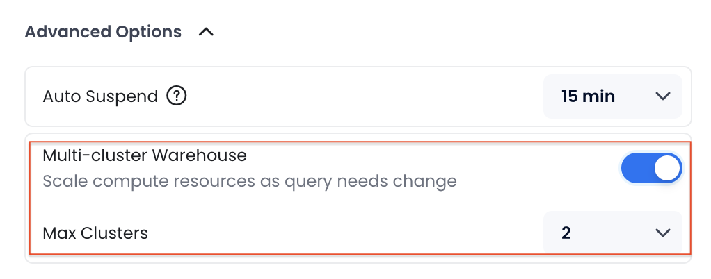

import PlaySVG from '@site/static/img/icon/play.svg'
import SuspendSVG from '@site/static/img/icon/suspend.svg'
import CheckboxSVG from '@site/static/img/icon/checkbox.svg'
import EllipsisSVG from '@site/static/img/icon/ellipsis.svg'
import  { Button } from 'antd'

计算集群是 Databend Cloud 的核心组件。一个计算集群代表一组包括 CPU、内存和本地缓存的计算资源。您必须运行一个计算集群来执行 SQL 任务，例如：

- 使用 SELECT 语句查询数据
- 使用 INSERT、UPDATE 或 DELETE 语句修改数据
- 使用 COPY INTO 命令将数据加载到表中

运行计算集群会产生费用。更多信息，请参阅 [计算集群定价](/guides/overview/editions/dc/pricing#warehouse-pricing)。

## 计算集群大小

在 Databend Cloud 中，计算集群有多种大小，每种大小由其可以处理的最大并发查询数量定义。创建计算集群时，您可以从以下大小中选择：

| 大小                  | 最大并发数 | 推荐使用场景                                                                                                                            |
|-----------------------|------------------|--------------------------------------------------------------------------------------------------------------------------------------------------|
| XSmall                | 2                | 最适合用于测试或运行轻量级查询等简单任务。适用于小型数据集（约 50GB）。                                          |
| Small                 | 4                | 非常适合运行常规报告和中等负载。适用于中等大小的数据集（约 200GB）。                                     |
| Medium                | 8                | 适合处理更复杂查询和高并发的团队。适用于较大的数据集（约 1TB）。                                 |
| Large                 | 16               | 非常适合运行许多并发查询的组织。适用于大型数据集（约 5TB）。                                             |
| XLarge                | 32               | 为企业级高并发工作负载构建。适用于非常大的数据集（超过 10TB）。                                        |
| 多集群扩展            | 最多无限         | 根据工作负载需求自动扩展和缩减，提供最经济高效的方式来根据需求提高并发性。 |

为了选择合适的计算集群大小，Databend 建议从较小的尺寸开始。较小的计算集群可能比中等或大型计算集群执行 SQL 任务的时间更长。如果您发现查询执行时间过长（例如，几分钟），请考虑升级到中等或大型计算集群以获得更快的查询结果。

## 管理计算集群 {#managing}

一个组织可以根据需要拥有任意数量的计算集群。**计算集群**页面显示您组织中的所有计算集群，并允许您管理它们。请注意，只有 `account_admin` 可以创建或删除计算集群。

### 暂停/恢复计算集群

暂停的计算集群不会消耗任何积分。您可以通过点击计算集群上的 <SuspendSVG/> 或 <PlaySVG/> 按钮手动暂停或恢复计算集群。但是，在以下情况下，计算集群可以自动暂停或恢复：

- 如果没有任何活动，计算集群可以根据其自动暂停设置自动暂停。
- 当您选择一个暂停的计算集群来执行 SQL 任务时，计算集群将自动恢复。

### 批量操作

您可以对计算集群执行批量操作，包括批量重启、批量暂停、批量恢复和批量删除。为此，通过在计算集群列表中勾选复选框 <CheckboxSVG/> 选择要进行批量操作的计算集群，然后点击椭圆按钮 <EllipsisSVG/> 以执行所需的操作。


### 最佳实践

为了有效管理您的计算集群并确保最佳性能和成本效益，请考虑以下最佳实践。这些指南将帮助您为各种工作负载和环境调整计算集群的大小、组织和微调：

- **选择合适的大小**  
  - 对于**开发和测试**，使用较小的计算集群（XSmall、Small）。  
  - 对于**生产环境**，选择较大的计算集群（Medium、Large、XLarge）。  

- **分离计算集群**  
  - 为**数据加载**和**查询执行**使用单独的计算集群。  
  - 为**开发**、**测试**和**生产**环境创建不同的计算集群。  

- **数据加载技巧**  
  - 较小的计算集群（Small、Medium）适合数据加载。  
  - 优化文件大小和文件数量以提高性能。  

- **优化成本和性能**  
  - 避免运行简单的查询，如 `SELECT 1`，以最小化积分使用。  
  - 使用批量加载（`COPY`）而不是单个 `INSERT` 语句。  
  - 监控长时间运行的查询并优化它们以提高性能。  

- **自动暂停**  
  - 启用自动暂停以在计算集群空闲时节省积分。  

- **频繁查询时禁用自动暂停**  
  - 保持计算集群活跃以进行频繁或重复的查询，以保持缓存并避免延迟。  

- **使用自动扩展（仅限商业和专属计划）**  
  - 多集群扩展根据工作负载需求自动调整资源。  

- **监控和调整使用情况**  
  - 定期审查计算集群使用情况并根据需要调整大小以平衡成本和性能。

## 计算集群访问控制

Databend Cloud 允许您通过为计算集群分配特定角色来管理计算集群访问，以便只有具有该角色的用户才能访问计算集群。

:::note
计算集群访问控制默认*未*启用。要启用它，请转到 **支持** > **创建新工单** 并提交请求。
:::

要为计算集群分配角色，请在计算集群创建或修改过程中在 **高级选项** 中选择所需的角色：


- 可以选择两个 [内置角色](../../56-security/access-control/02-roles.md#built-in-roles)，您还可以使用 [CREATE ROLE](/sql/sql-commands/ddl/user/user-create-role) 命令创建其他角色。有关 Databend 角色的更多信息，请参阅 [角色](../../56-security/access-control/02-roles.md)。
- 未分配角色的计算集群默认使用 `public` 角色，允许所有用户访问。
- 您可以使用 [GRANT](/sql/sql-commands/ddl/user/grant) 命令将角色授予用户（Databend Cloud 登录邮箱或 SQL 用户），或者在邀请用户加入您的组织时分配角色。更多信息，请参阅 [邀请新成员](00-organization.md#inviting-new-members)。此示例将角色 `manager` 授予邮箱为 `name@example.com` 的用户，允许访问分配给 `manager` 角色的任何计算集群：

  ```sql title='示例：'
  GRANT ROLE manager to 'name@example.com';
  ```

## 多集群计算集群

多集群计算集群通过根据工作负载需求添加或移除集群来自动调整计算资源。它确保高并发性和性能，同时通过根据需要扩展或缩减来优化成本。

:::note
多集群仅适用于 Databend Cloud 商业和专属计划的用户。
:::

### 工作原理

默认情况下，一个计算集群由一组计算资源组成，可以根据其大小处理最大数量的并发查询。当为计算集群启用多集群时，它允许动态添加多个集群（由 **最大集群数** 设置定义）来处理超过单个集群容量的工作负载。

当并发查询数量超过计算集群的容量时，会添加一个额外的集群来处理额外的负载。如果需求继续增长，会逐个添加更多集群。随着查询需求减少，长时间没有活动的集群会自动关闭。


### 启用多集群

您可以在创建计算集群时启用多集群，并设置计算集群可以扩展到的最大集群数量。请注意，如果为计算集群启用了多集群，**自动暂停** 持续时间必须设置为至少 15 分钟。



### 成本计算

多集群计算集群根据在特定时间间隔内使用的活跃集群数量计费。

例如，对于每小时定价为 $1 的 XSmall 计算集群，如果一个集群在 13:00 到 14:00 期间活跃使用，两个集群在 14:00 到 15:00 期间活跃使用，则从 13:00 到 15:00 的总成本为 $3 ((1 集群 × 1 小时 × $1) + (2 集群 × 1 小时 × $1))。

## 连接到计算集群 {#connecting}

连接到计算集群提供了在 Databend Cloud 中运行查询和分析数据所需的计算资源。当从您的应用程序或 SQL 客户端访问 Databend Cloud 时，此连接是必要的。

要获取计算集群的连接信息：

1. 点击 **概览** 页面上的 **连接**。
2. 选择您希望连接的数据库和计算集群。连接信息将根据您的选择更新。
3. 连接详细信息包括一个名为 `cloudapp` 的 SQL 用户，其密码是随机生成的。Databend Cloud 不存储此密码。请务必复制并安全保存。如果您忘记了密码，请点击 **重置** 以生成一个新密码。