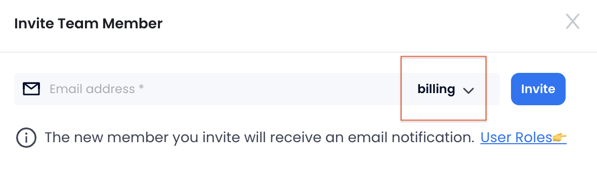

您可以在**管理** > **账单**下查看您组织当月的消费和账单历史记录。

## 限制您的成本

对于管理员用户，Databend Cloud 提供了为其组织设置消费限额的选项。这允许管理员控制在平台上花费的最大金额。为此，请转到主页并单击**激活消费限额**。在下一页上，您可以打开**启用消费限额**按钮，并指定组织允许的每月最高消费额。

:::note
您设置的消费限额将适用于每个日历月。例如，如果您在 8 月 10 日设置了限额，它将在整个 8 月生效，从 1 日到 31 日。
:::

当您设置消费限额时，您需要决定 Databend Cloud 在达到限额时应采取什么措施。目前，有两个选项：

- **暂停服务**：您的计算集群将无法运行，直到当月结束或您设置更高的限额。

- **仅发送通知**：您组织的管理员将收到电子邮件通知，告知消费限额即将达到。您的计算集群可以继续正常运行。

对于“仅发送通知”选项，Databend Cloud 将根据以下频率周期向管理员发送电子邮件通知：

| 消费范围 	| 通知频率 	|
|----------------	|------------------------	|
| 80% - 90%      	| 每三天       	|
| 90% - 100%     	| 每三天       	|
| 100% 或以上     | 每三天       	|

## 授予财务人员访问权限

为了方便您的财务团队的工作，同时确保数据安全，您可以在 Databend Cloud 中创建一个名为 `billing` 的角色。此角色将专门用于提供仅与账单相关的信息的访问权限。

```sql
CREATE ROLE billing;
```

在邀请财务人员加入您的组织时，请为他们分配此 `billing` 角色。



一旦他们登录 Databend Cloud，他们将拥有受限的访问权限，仅限于账单页面，所有其他与业务相关的页面都将从视图中隐藏。这种方法通过限制对 Databend Cloud 环境的其他部分的不必要访问，有助于保护敏感数据。

