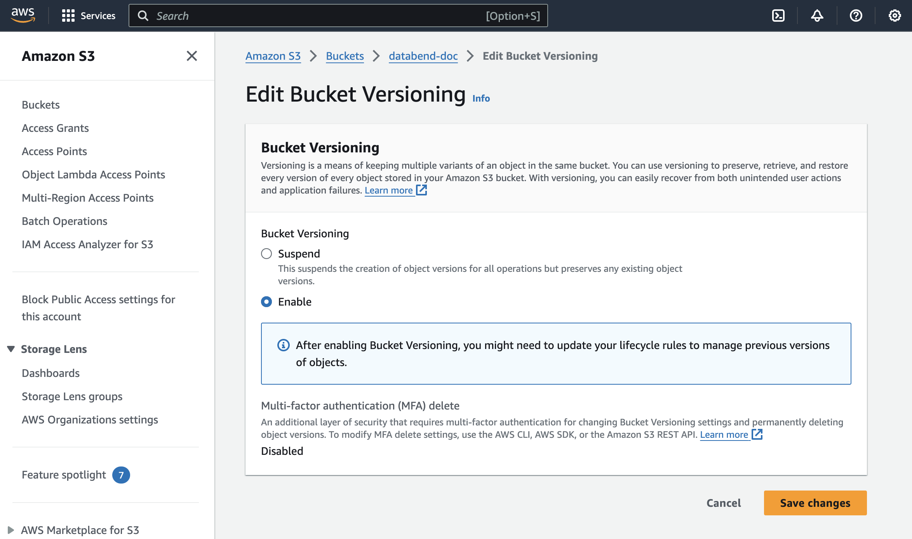
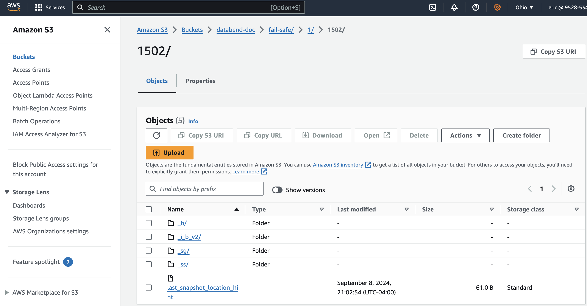
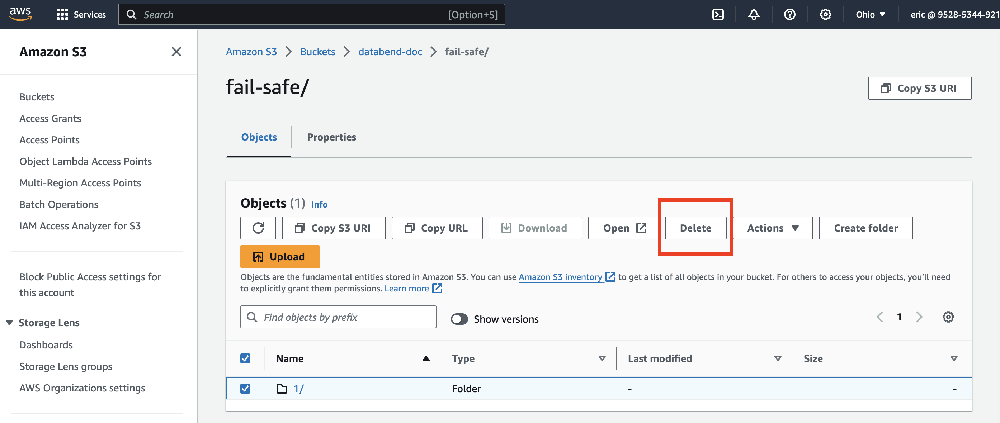

import IndexOverviewList from '@site/src/components/IndexOverviewList';
import EEFeature from '@site/src/components/EEFeature';

<EEFeature featureName='FAIL-SAFE'/>

Fail-Safe 指的是旨在从对象存储中恢复丢失或意外删除的数据的机制。

- 存储兼容性：目前，Fail-Safe 仅支持 S3 兼容的存储类型。
- Bucket 版本控制：为了使 Fail-Safe 正常工作，必须启用 bucket 版本控制。请注意，在启用版本控制之前创建的数据*无法*使用此方法恢复。

### 实施 Fail-Safe

Databend 提供了 [SYSTEM$FUSE_AMEND](/sql/sql-functions/table-functions/fuse-amend) 表函数来启用 Fail-Safe 恢复。此函数允许您在启用 bucket 版本控制时从 S3 兼容的存储 bucket 恢复数据。

### 使用示例

以下是使用 [SYSTEM$FUSE_AMEND](/sql/sql-functions/table-functions/fuse-amend) 函数从 S3 恢复表数据的分步示例：

1. 为 bucket `databend-doc` 启用版本控制。



2. 创建一个外部表，将表数据存储在 `databend-doc` bucket 的 `fail-safe` 文件夹中。

```sql
CREATE TABLE t(a INT) 
's3://databend-doc/fail-safe/' 
CONNECTION = (access_key_id ='<your-access-key-id>' secret_access_key ='<your-secret-accesskey>');

-- 插入示例数据
INSERT INTO t VALUES (1), (2), (3);
```

如果现在打开 bucket 中的 `fail-safe` 文件夹，您可以看到数据已存在：



3. 通过删除 `fail-safe` 文件夹中的所有子文件夹及其文件来模拟数据丢失。



4. 删除后尝试查询表将导致错误：

```sql
SELECT * FROM t;

error: APIError: ResponseError with 3001: NotFound (persistent) at read, context: { uri: https://s3.us-east-2.amazonaws.com/databend-doc/fail-safe/1/1502/_b/3f84d636dc6c40508720d1cde20d4f3b_v2.parquet, response: Parts { status: 404, version: HTTP/1.1, headers: {"x-amz-request-id": "FYSJNZX1X16T91HN", "x-amz-id-2": "EI+NQjyRlSk8jlU64EASKodjvOkzuAlhZ1CYo0nIenzOH6DP7t6mMWh7raj4mUiOxW18NQesxmA=", "x-amz-delete-marker": "true", "x-amz-version-id": "ngecunzFP0pir0ysXlbR_eJafaTPl1oh", "content-type": "application/xml", "transfer-encoding": "chunked", "date": "Mon, 09 Sep 2024 02:01:57 GMT", "server": "AmazonS3"} }, service: s3, path: 1/1502/_b/3f84d636dc6c40508720d1cde20d4f3b_v2.parquet, range: 4-47 } => S3Error { code: "NoSuchKey", message: "The specified key does not exist.", resource: "", request_id: "FYSJNZX1X16T91HN" }
```

5. 使用 system$fuse_amend 恢复表数据：

```sql
CALL system$fuse_amend('default', 't');

-[ RECORD 1 ]-----------------------------------
result: Ok
```

6. 验证表数据是否恢复：

```sql
SELECT * FROM t;

┌─────────────────┐
│        a        │
├─────────────────┤
│               1 │
│               2 │
│               3 │
└─────────────────┘
```