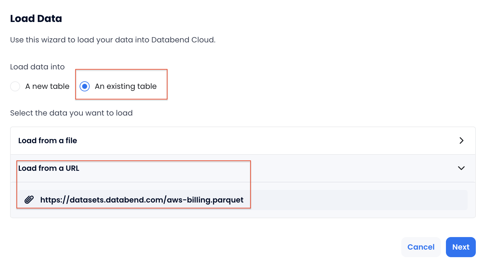
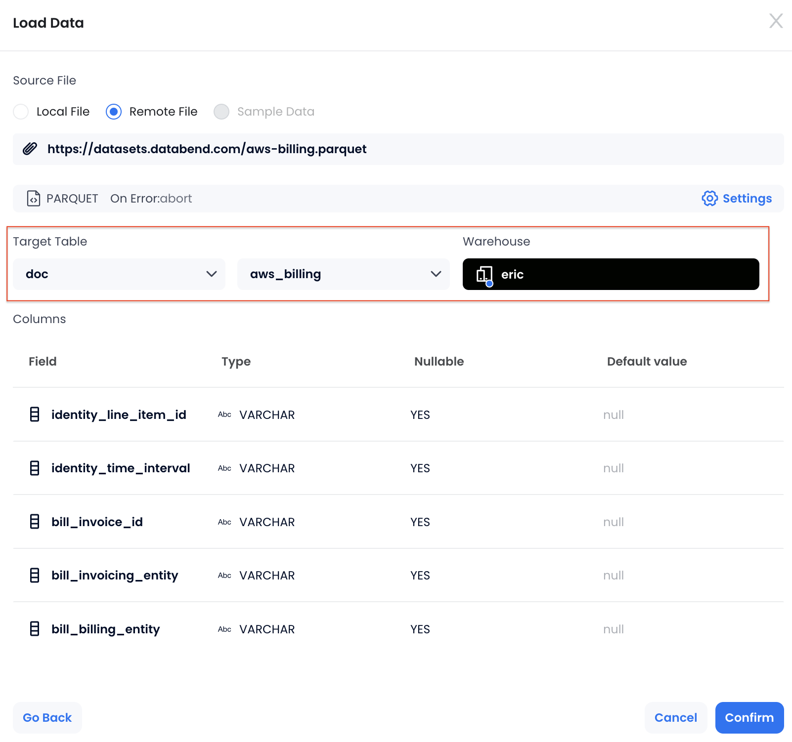

在本教程中，我们将演示如何导入 AWS 账单数据，并通过 SQL 进行成本分析。你会学习如何把 AWS 账单数据加载进 Databend Cloud、使用查询找出主要成本驱动因素，并洞察 AWS 的使用方式。

AWS 账单数据详细记录了云服务的用量及对应费用，可直接在 AWS Billing Console 的 Cost and Usage Reports (CUR) 服务中以 Parquet 格式导出。本教程所用的数据集位于 [https://datasets.databend.com/aws-billing.parquet](https://datasets.databend.com/aws-billing.parquet)，遵循 CUR 规范，包含服务名称、用量类型、定价等字段。完整的字段释义请参考 [AWS Cost and Usage Report Data Dictionary](https://docs.aws.amazon.com/cur/latest/userguide/data-dictionary.html)。

## 步骤 1：创建目标表

打开 Worksheet，创建名为 `doc` 的数据库，并创建 `aws_billing` 表：

```sql
CREATE DATABASE doc;

CREATE TABLE aws_billing (
    identity_line_item_id STRING,
    identity_time_interval STRING,
    bill_invoice_id STRING,
    bill_invoicing_entity STRING,
    bill_billing_entity STRING,
    bill_bill_type STRING,
    bill_payer_account_id STRING,
    bill_billing_period_start_date TIMESTAMP,
    bill_billing_period_end_date TIMESTAMP,
    line_item_usage_account_id STRING,
    line_item_line_item_type STRING,
    line_item_usage_start_date TIMESTAMP,
    line_item_usage_end_date TIMESTAMP,
    line_item_product_code STRING,
    line_item_usage_type STRING,
    line_item_operation STRING,
    line_item_availability_zone STRING,
    line_item_usage_amount DOUBLE,
    line_item_normalization_factor DOUBLE,
    line_item_normalized_usage_amount DOUBLE,
    line_item_currency_code STRING,
    line_item_unblended_rate STRING,
    line_item_unblended_cost DOUBLE,
    line_item_blended_rate STRING,
    line_item_blended_cost DOUBLE,
    line_item_line_item_description STRING,
    line_item_tax_type STRING,
    line_item_legal_entity STRING,
    product_product_name STRING,
    product_purchase_option STRING,
    product_availability STRING,
    product_availability_zone STRING,
    product_capacitystatus STRING,
    product_classicnetworkingsupport STRING,
    product_clock_speed STRING,
    product_content_type STRING,
    product_cputype STRING,
    product_current_generation STRING,
    product_database_engine STRING,
    product_dedicated_ebs_throughput STRING,
    product_deployment_option STRING,
    product_description STRING,
    product_durability STRING,
    product_ecu STRING,
    product_endpoint_type STRING,
    product_engine_code STRING,
    product_enhanced_networking_supported STRING,
    product_equivalentondemandsku STRING,
    product_fee_code STRING,
    product_fee_description STRING,
    product_from_location STRING,
    product_from_location_type STRING,
    product_from_region_code STRING,
    product_gpu STRING,
    product_gpu_memory STRING,
    product_group STRING,
    product_group_description STRING,
    product_instance_family STRING,
    product_instance_type STRING,
    product_instance_type_family STRING,
    product_intel_avx2_available STRING,
    product_intel_avx_available STRING,
    product_intel_turbo_available STRING,
    product_license_model STRING,
    product_location STRING,
    product_location_type STRING,
    product_logs_destination STRING,
    product_marketoption STRING,
    product_max_iops_burst_performance STRING,
    product_max_iopsvolume STRING,
    product_max_throughputvolume STRING,
    product_max_volume_size STRING,
    product_memory STRING,
    product_memory_gib STRING,
    product_memorytype STRING,
    product_message_delivery_frequency STRING,
    product_message_delivery_order STRING,
    product_min_volume_size STRING,
    product_network_performance STRING,
    product_normalization_size_factor STRING,
    product_operating_system STRING,
    product_operation STRING,
    product_origin STRING,
    product_physical_processor STRING,
    product_pre_installed_sw STRING,
    product_pricingplan STRING,
    product_processor_architecture STRING,
    product_processor_features STRING,
    product_product_family STRING,
    product_provider STRING,
    product_purchaseterm STRING,
    product_queue_type STRING,
    product_recipient STRING,
    product_region STRING,
    product_region_code STRING,
    product_request_type STRING,
    product_servicecode STRING,
    product_servicename STRING,
    product_sku STRING,
    product_snapshotarchivefeetype STRING,
    product_storage STRING,
    product_storage_class STRING,
    product_storage_media STRING,
    product_storage_type STRING,
    product_subservice STRING,
    product_tenancy STRING,
    product_tiertype STRING,
    product_to_location STRING,
    product_to_location_type STRING,
    product_to_region_code STRING,
    product_transfer_type STRING,
    product_type STRING,
    product_usagetype STRING,
    product_vcpu STRING,
    product_version STRING,
    product_volume_api_name STRING,
    product_volume_type STRING,
    product_vpcnetworkingsupport STRING,
    pricing_lease_contract_length STRING,
    pricing_offering_class STRING,
    pricing_purchase_option STRING,
    pricing_rate_code STRING,
    pricing_rate_id STRING,
    pricing_currency STRING,
    pricing_public_on_demand_cost DOUBLE,
    pricing_public_on_demand_rate STRING,
    pricing_term STRING,
    pricing_unit STRING,
    reservation_amortized_upfront_cost_for_usage DOUBLE,
    reservation_amortized_upfront_fee_for_billing_period DOUBLE,
    reservation_effective_cost DOUBLE,
    reservation_end_time STRING,
    reservation_modification_status STRING,
    reservation_normalized_units_per_reservation STRING,
    reservation_number_of_reservations STRING,
    reservation_recurring_fee_for_usage DOUBLE,
    reservation_start_time STRING,
    reservation_subscription_id STRING,
    reservation_total_reserved_normalized_units STRING,
    reservation_total_reserved_units STRING,
    reservation_units_per_reservation STRING,
    reservation_unused_amortized_upfront_fee_for_billing_period DOUBLE,
    reservation_unused_normalized_unit_quantity DOUBLE,
    reservation_unused_quantity DOUBLE,
    reservation_unused_recurring_fee DOUBLE,
    reservation_upfront_value DOUBLE,
    savings_plan_total_commitment_to_date DOUBLE,
    savings_plan_savings_plan_a_r_n STRING,
    savings_plan_savings_plan_rate DOUBLE,
    savings_plan_used_commitment DOUBLE,
    savings_plan_savings_plan_effective_cost DOUBLE,
    savings_plan_amortized_upfront_commitment_for_billing_period DOUBLE,
    savings_plan_recurring_commitment_for_billing_period DOUBLE,
    savings_plan_start_time STRING,
    savings_plan_end_time STRING,
    savings_plan_offering_type STRING,
    savings_plan_payment_option STRING,
    savings_plan_purchase_term STRING,
    savings_plan_region STRING
);
```

## 步骤 2：加载 AWS 账单数据集

本步骤将在 Databend Cloud 中通过几次点击完成数据加载。

1. 在 Databend Cloud 内，选择 **Overview** > **Load Data** 打开数据导入向导。
2. 选择 **An existing table** 作为目标表，点击 **Load from a URL** 并输入数据集地址 `https://datasets.databend.com/aws-billing.parquet`。



3. 选择刚刚创建的数据库及表，并指定要使用的 Warehouse。



4. 点击 **Confirm** 开始加载。

## 步骤 3：使用 SQL 分析成本

账单数据加载完毕后，就可以用 SQL 查询来分析 AWS 账单。本节提供了一些示例，帮助你快速识别花费最多的部分。

以下查询会找出花费最高的服务：

```sql
SELECT
    product_servicename AS Service,
    SUM(line_item_blended_cost) AS Total_Cost
FROM aws_billing
WHERE
    line_item_blended_cost IS NOT NULL
    AND product_servicename != ''
GROUP BY product_servicename
ORDER BY Total_Cost DESC
LIMIT 25;
```

以下查询会标出成本最高的 AWS EC2 资源：

```sql
SELECT
    line_item_line_item_description,
    SUM(line_item_blended_cost) AS Total_Cost
FROM aws_billing
WHERE
    product_servicename = 'Amazon Elastic Compute Cloud'
    AND line_item_blended_cost IS NOT NULL
    AND identity_line_item_id != ''
GROUP BY line_item_line_item_description
ORDER BY Total_Cost DESC
LIMIT 25;
```

以下查询会找出花费最高的 S3 Bucket：

```sql
SELECT
    line_item_line_item_description,
    SUM(line_item_blended_cost) AS Cost    
FROM aws_billing
WHERE
    line_item_product_code = 'AmazonS3'
    AND line_item_line_item_description != ''
GROUP BY line_item_line_item_description
ORDER BY Cost DESC
LIMIT 25;
```

以下查询会根据综合成本找出最贵的 25 个 Region：

```sql
SELECT
    product_region AS Region,
    SUM(line_item_blended_cost) AS Total_Cost
FROM aws_billing
WHERE
    line_item_blended_cost IS NOT NULL
    AND product_region IS NOT NULL
GROUP BY product_region
ORDER BY Total_Cost DESC
LIMIT 25;
```

以下查询会把成本按照实例类型（Reserved Instances 与 On-Demand）分类，方便了解各类型的支出贡献：

```sql
SELECT
    CASE
        WHEN reservation_amortized_upfront_cost_for_usage IS NOT NULL THEN 'Reserved Instances'
        ELSE 'On-Demand'
    END AS Instance_Type,
    SUM(line_item_blended_cost) AS Total_Cost
FROM aws_billing
WHERE
    line_item_blended_cost IS NOT NULL
GROUP BY Instance_Type
ORDER BY Total_Cost DESC;
```
