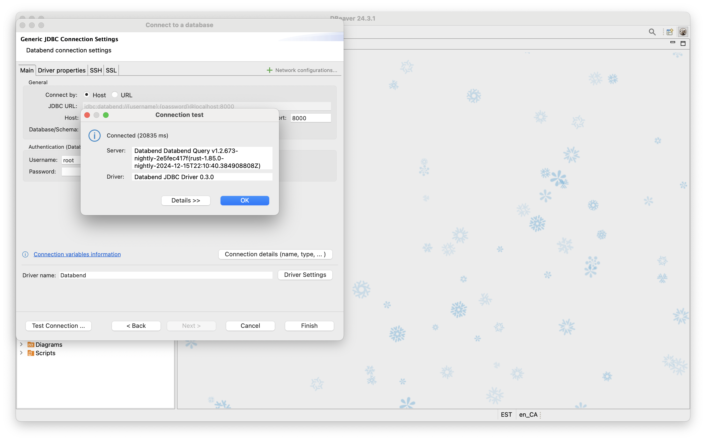

import StepsWrap from '@site/src/components/StepsWrap';
import StepContent from '@site/src/components/Steps/step-content';

在本教程中，我们将指导您完成使用 DBeaver 连接到私有化部署 Databend 实例的过程。

<StepsWrap>
<StepContent number="1">

### 开始之前

- 确保您的本地机器上安装了 [Docker](https://www.docker.com/)，因为它将用于启动 Databend。
- 确认您的本地机器上安装了 DBeaver 24.3.1 或更高版本。

</StepContent>
<StepContent number="2">

### 启动 Databend

在您的终端中运行以下命令以启动 Databend 实例：

:::note
如果在启动容器时没有为 `QUERY_DEFAULT_USER` 或 `QUERY_DEFAULT_PASSWORD` 指定自定义值，则将创建一个默认的 `root` 用户，且没有密码。
:::

```bash
docker run -d --name databend \
  -p 3307:3307 -p 8000:8000 -p 8124:8124 -p 8900:8900 \
  datafuselabs/databend:nightly
```

</StepContent>
<StepContent number="3">

### 设置连接

1. 在 DBeaver 中，转到 **Database** > **New Database Connection** 以打开连接向导，然后在 **Analytical** 类别下选择 **Databend**。


2. 为 **Username** 输入 `root`。


3. 点击 **Test Connection** 以验证连接。如果这是您第一次连接到 Databend，系统将提示您下载驱动程序。点击 **Download** 继续。


下载完成后，测试连接应该成功，如下所示：



</StepContent>
</StepsWrap>