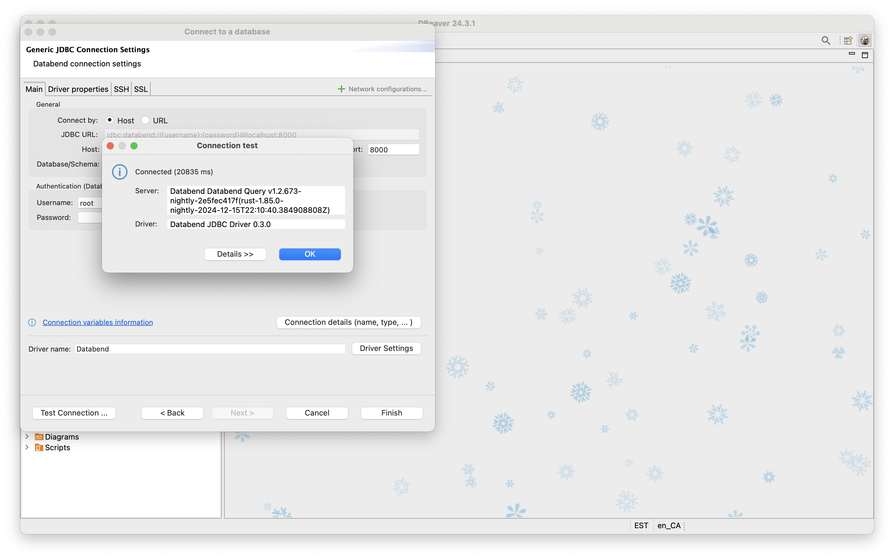

import StepsWrap from '@site/src/components/StepsWrap';
import StepContent from '@site/src/components/Steps/step-content';

本教程将指导你如何使用 DBeaver 连接自建 Databend 实例。

<StepsWrap>
<StepContent number="1">

### 开始之前

- 请先在本地安装 [Docker](https://www.docker.com/)，用于启动 Databend。
- 请确保本地已安装 DBeaver 24.3.1 或更高版本。

</StepContent>
<StepContent number="2">

### 启动 Databend

在终端运行以下命令启动 Databend：

:::note
如果启动容器时未设置 `QUERY_DEFAULT_USER` 或 `QUERY_DEFAULT_PASSWORD`，系统会默认创建没有密码的 `root` 用户。
:::

```bash
docker run -d --name databend \
  -p 3307:3307 -p 8000:8000 -p 8124:8124 -p 8900:8900 \
  datafuselabs/databend:nightly
```

</StepContent>
<StepContent number="3">

### 建立连接

1. 在 DBeaver 中依次点击 **Database** > **New Database Connection** 打开连接向导，在 **Analytical** 分类下选择 **Databend**。


2. 将 **Username** 设置为 `root`。


3. 点击 **Test Connection** 进行测试。如果是首次连接 Databend，DBeaver 会提示下载驱动，点击 **Download**。下载完成后连接测试应成功，如下图：



</StepContent>
</StepsWrap>
