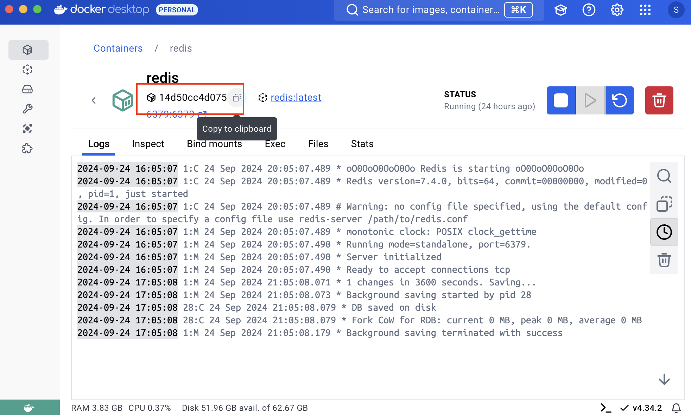

本教程将演示如何在 Databend 中通过 Dictionary 访问 MySQL 与 Redis 数据。你将学习如何为外部数据源创建 Dictionary，并像查询本地表一样无缝读取这些数据。

## 开始之前

请在本地安装 [Docker](https://www.docker.com/)，用于启动 Databend、MySQL 与 Redis 容器。同时需要一个连接 MySQL 的 SQL 客户端，推荐使用 [BendSQL](/guides/sql-clients/bendsql/) 连接 Databend。

## 步骤 1：搭建环境

本步骤会在本地通过 Docker 启动 Databend、MySQL 与 Redis。

1. 创建名为 `mynetwork` 的 Docker 网络，供各容器互通：

```bash
docker network create mynetwork
```

2. 在该网络内启动名为 `mysql` 的 MySQL 容器：

```bash
docker run -d \
  --name=mysql \
  --network=mynetwork \
  -e MYSQL_ROOT_PASSWORD=admin \
  -p 3306:3306 \
  mysql:latest
```

3. 启动名为 `databend` 的 Databend 容器：

```bash
docker run -d \
  --name=databend \
  --network=mynetwork \
  -p 3307:3307 \
  -p 8000:8000 \
  -p 8124:8124 \
  -p 8900:8900 \
  datafuselabs/databend:nightly
```

4. 启动名为 `redis` 的 Redis 容器：

```bash
docker run -d \
  --name=redis \
  --network=mynetwork \
  -p 6379:6379 \
  redis:latest
```

5. 检查 `mynetwork`，确认三个容器都在同一网络：

```bash
docker network inspect mynetwork
```

输出示例：

```bash
[
    {
        "Name": "mynetwork",
        ...
            "Containers": {
                "14d50cc4d075158a6d5fa4e6c8b7db60960f8ba1f64d6bceff0692c7e99f37b5": {
                    "Name": "redis",
                    ...
                },
                "276bc1023f0ea999afc41e063f1f3fe7404cb6fbaaf421005d5c05be343ce5e5": {
                    "Name": "databend",
                    ...
                },
                "95c21de94d27edc5e6fa8e335e0fd5bff12557fa30889786de9f483b8d111dbc": {
                    "Name": "mysql",
                    ...
                }
            },
        ...
    }
]
```

## 步骤 2：准备示例数据

本步骤将在 Databend、MySQL 与 Redis 中写入示例数据。

1. 在 Databend 中创建 `users_databend` 表并插入示例数据：

```sql
CREATE TABLE users_databend (
    id INT,
    name VARCHAR(100) NOT NULL
);

INSERT INTO users_databend (id, name) VALUES
(1, 'Alice'),
(2, 'Bob'),
(3, 'Charlie');
```

2. 在 MySQL 中创建 `dict` 数据库与 `users` 表，并插入示例数据：

```sql
CREATE DATABASE dict;
USE dict;

CREATE TABLE users (
    id INT AUTO_INCREMENT PRIMARY KEY,
    name VARCHAR(100) NOT NULL,
    email VARCHAR(100) NOT NULL
);

INSERT INTO users (name, email) VALUES
('Alice', 'alice@example.com'),
('Bob', 'bob@example.com'),
('Charlie', 'charlie@example.com');
```

3. 通过 Docker Desktop 或运行 `docker ps` 找到 Redis 容器 ID：



4. 使用容器 ID 进入 Redis CLI（将 `14d50cc4d075` 替换为实际 ID）：

```bash
docker exec -it 14d50cc4d075 redis-cli
```

5. 在 Redis CLI 中插入示例数据：

```bash
SET user:1 '{"notifications": "enabled", "theme": "dark"}'
SET user:2 '{"notifications": "disabled", "theme": "light"}'
SET user:3 '{"notifications": "enabled", "theme": "dark"}'
```

## 步骤 3：创建 Dictionary

本步骤将在 Databend 中为 MySQL 与 Redis 创建 Dictionary，并通过查询提取外部数据。

1. 在 Databend 中创建名为 `mysql_users` 的 Dictionary 指向 MySQL：

```sql
CREATE DICTIONARY mysql_users
(
    id INT,
    name STRING,
    email STRING
)
PRIMARY KEY id
SOURCE(MySQL(
    host='mysql'
    port=3306
    username='root'
    password='admin'
    db='dict'
    table='users'
));
```

2. 创建名为 `redis_user_preferences` 的 Dictionary 指向 Redis：

```sql
CREATE DICTIONARY redis_user_preferences
(
    user_id STRING,
    preferences STRING
)
PRIMARY KEY user_id
SOURCE(Redis(
    host='redis'
    port=6379
));
```

3. 查询两个 Dictionary：

```sql
SELECT 
    u.id,
    u.name,
    DICT_GET(mysql_users, 'email', u.id) AS email,
    DICT_GET(redis_user_preferences, 'preferences', CONCAT('user:', TO_STRING(u.id))) AS user_preferences
FROM 
    users_databend AS u;
```

该查询会返回用户的 ID、姓名，同时通过 MySQL Dictionary 获取 email，通过 Redis Dictionary 获取偏好设置。

```sql title='Result:'
┌──────────────────────────────────────────────────────────────────────────────────────────────────────────────────────────────────────────────────────────────────────┐
│        id       │   name  │ dict_get(default.mysql_users, 'email', u.id) │ dict_get(default.redis_user_preferences, 'preferences', CONCAT('user:', TO_STRING(u.id))) │
│ Nullable(Int32) │  String │               Nullable(String)               │                                      Nullable(String)                                     │
├─────────────────┼─────────┼──────────────────────────────────────────────┼───────────────────────────────────────────────────────────────────────────────────────────┤
│               1 │ Alice   │ alice@example.com                            │ {"notifications": "enabled", "theme": "dark"}                                             │
│               2 │ Bob     │ bob@example.com                              │ {"notifications": "disabled", "theme": "light"}                                           │
│               3 │ Charlie │ charlie@example.com                          │ {"notifications": "enabled", "theme": "dark"}                                             │
└──────────────────────────────────────────────────────────────────────────────────────────────────────────────────────────────────────────────────────────────────────┘
```
