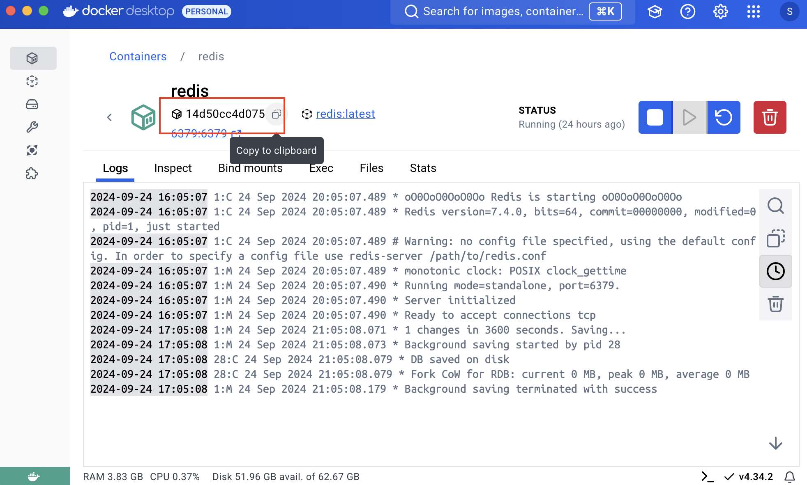

本教程将带你了解如何在 Databend 中使用 Dictionary 访问 MySQL 和 Redis 数据。你将学会创建映射到这些外部数据源的 Dictionary，从而实现无缝的数据查询与集成。

## 准备工作

开始前，请确保本机已安装 [Docker](https://www.docker.com/)，我们需要用它来启动 Databend、MySQL 和 Redis 容器。此外还需要一个 SQL 客户端连接 MySQL；连接 Databend 推荐使用 [BendSQL](/guides/connect/sql-clients/bendsql)。

## 第一步：搭建环境

本步骤将在本机通过 Docker 启动 Databend、MySQL 和 Redis 实例。

1. 创建名为 `mynetwork` 的 Docker 网络，让三个容器之间可以互相通信：

```bash
docker network create mynetwork
```

2. 在 `mynetwork` 网络中启动名为 `mysql` 的 MySQL 容器：

```bash
docker run -d \
  --name=mysql \
  --network=mynetwork \
  -e MYSQL_ROOT_PASSWORD=admin \
  -p 3306:3306 \
  mysql:latest
```

3. 在 `mynetwork` 网络中启动名为 `databend` 的 Databend 容器：

```bash
docker run -d \
  --name=databend \
  --network=mynetwork \
  -p 3307:3307 \
  -p 8000:8000 \
  -p 8124:8124 \
  -p 8900:8900 \
  datafuselabs/databend:nightly
```

4. 在 `mynetwork` 网络中启动名为 `redis` 的 Redis 容器：

```bash
docker run -d \
  --name=redis \
  --network=mynetwork \
  -p 6379:6379 \
  redis:latest
```

5. 检查 `mynetwork` 网络，确认三个容器均已接入同一网络：

```bash
docker network inspect mynetwork

[
    {
        "Name": "mynetwork",
        "Id": "ba8984e9ca07f49dd6493fd7c8be9831bda91c44595fc54305fc6bc241a77485",
        "Created": "2024-09-23T21:24:34.59324771Z",
        "Scope": "local",
        "Driver": "bridge",
        "EnableIPv6": false,
        "IPAM": {
            "Driver": "default",
            "Options": {},
            "Config": [
                {
                    "Subnet": "172.18.0.0/16",
                    "Gateway": "172.18.0.1"
                }
            ]
        },
        "Internal": false,
        "Attachable": false,
        "Ingress": false,
        "ConfigFrom": {
            "Network": ""
        },
        "ConfigOnly": false,
        "Containers": {
            "14d50cc4d075158a6d5fa4e6c8b7db60960f8ba1f64d6bceff0692c7e99f37b5": {
                "Name": "redis",
                "EndpointID": "e1d1015fea745bbbb34c6a9fb11010b6960a139914b7cc2c6a20fbca4f3b77d8",
                "MacAddress": "02:42:ac:12:00:04",
                "IPv4Address": "172.18.0.4/16",
                "IPv6Address": ""
            },
            "276bc1023f0ea999afc41e063f1f3fe7404cb6fbaaf421005d5c05be343ce5e5": {
                "Name": "databend",
                "EndpointID": "ac915b9df2fef69c5743bf16b8f07e0bb8c481ca7122b171d63fb9dc2239f873",
                "MacAddress": "02:42:ac:12:00:03",
                "IPv4Address": "172.18.0.3/16",
                "IPv6Address": ""
            },
            "95c21de94d27edc5e6fa8e335e0fd5bff12557fa30889786de9f483b8d111dbc": {
                "Name": "mysql",
                "EndpointID": "44fdf40de8c3d4c8fec39eb03ef1219c9cf1548e9320891694a9758dd0540ce3",
                "MacAddress": "02:42:ac:12:00:02",
                "IPv4Address": "172.18.0.2/16",
                "IPv6Address": ""
            }
        },
        "Options": {},
        "Labels": {}
    }
]
```

## 第二步：准备示例数据

本步骤将向 MySQL、Redis 和 Databend 中分别写入示例数据。

1. 在 Databend 中创建 `users_databend` 表并插入示例用户数据：

```sql
CREATE TABLE users_databend (
    id INT,
    name VARCHAR(100) NOT NULL
);

INSERT INTO users_databend (id, name) VALUES
(1, 'Alice'),
(2, 'Bob'),
(3, 'Charlie');
```

2. 在 MySQL 中创建 `dict` 数据库，建立 `users` 表并插入示例数据：

```sql
CREATE DATABASE dict;
USE dict;

CREATE TABLE users (
    id INT AUTO_INCREMENT PRIMARY KEY,
    name VARCHAR(100) NOT NULL,
    email VARCHAR(100) NOT NULL
);

INSERT INTO users (name, email) VALUES
('Alice', 'alice@example.com'),
('Bob', 'bob@example.com'),
('Charlie', 'charlie@example.com');
```

3. 在 Docker Desktop 中找到 Redis 容器 ID，或通过终端运行 `docker ps` 查看：



4. 使用 Redis 容器 ID 进入 Redis CLI（将 `14d50cc4d075` 替换为你的实际容器 ID）：

```bash
docker exec -it 14d50cc4d075 redis-cli
```

5. 在 Redis CLI 中执行以下命令，写入示例用户偏好数据：

```bash
SET user:1 '{"notifications": "enabled", "theme": "dark"}'
SET user:2 '{"notifications": "disabled", "theme": "light"}'
SET user:3 '{"notifications": "enabled", "theme": "dark"}'
```

## 第三步：创建 Dictionary

本步骤将在 Databend 中分别为 MySQL 和 Redis 创建 Dictionary，并查询外部数据。

1. 在 Databend 中创建名为 `mysql_users` 的 Dictionary，连接到 MySQL 实例：

```sql
CREATE DICTIONARY mysql_users
(
    id INT,
    name STRING,
    email STRING
)
PRIMARY KEY id
SOURCE(MySQL(
    host='mysql'
    port=3306
    username='root'
    password='admin'
    db='dict'
    table='users'
));
```

2. 创建名为 `redis_user_preferences` 的 Dictionary，连接到 Redis 实例：

```sql
CREATE DICTIONARY redis_user_preferences
(
    user_id STRING,
    preferences STRING
)
PRIMARY KEY user_id
SOURCE(Redis(
    host='redis'
    port=6379
));
```

3. 查询刚才创建的 MySQL 和 Redis Dictionary 中的数据：

```sql
SELECT
    u.id,
    u.name,
    DICT_GET(mysql_users, 'email', u.id) AS email,
    DICT_GET(redis_user_preferences, 'preferences', CONCAT('user:', TO_STRING(u.id))) AS user_preferences
FROM
    users_databend AS u;
```

上述查询从 `users_databend` 表中获取用户 ID 和姓名，同时通过 MySQL Dictionary 获取邮箱，通过 Redis Dictionary 获取用户偏好设置。

```sql title='查询结果：'
┌──────────────────────────────────────────────────────────────────────────────────────────────────────────────────────────────────────────────────────────────────────┐
│        id       │   name  │ dict_get(default.mysql_users, 'email', u.id) │ dict_get(default.redis_user_preferences, 'preferences', CONCAT('user:', TO_STRING(u.id))) │
│ Nullable(Int32) │  String │               Nullable(String)               │                                      Nullable(String)                                     │
├─────────────────┼─────────┼──────────────────────────────────────────────┼───────────────────────────────────────────────────────────────────────────────────────────┤
│               1 │ Alice   │ alice@example.com                            │ {"notifications": "enabled", "theme": "dark"}                                             │
│               2 │ Bob     │ bob@example.com                              │ {"notifications": "disabled", "theme": "light"}                                           │
│               3 │ Charlie │ charlie@example.com                          │ {"notifications": "enabled", "theme": "dark"}                                             │
└──────────────────────────────────────────────────────────────────────────────────────────────────────────────────────────────────────────────────────────────────────┘
```
