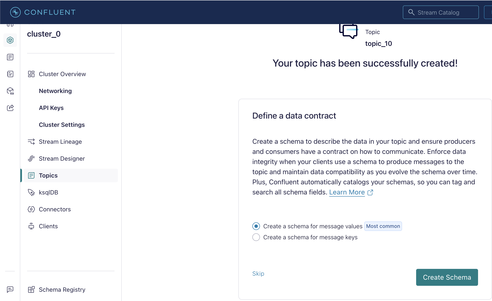
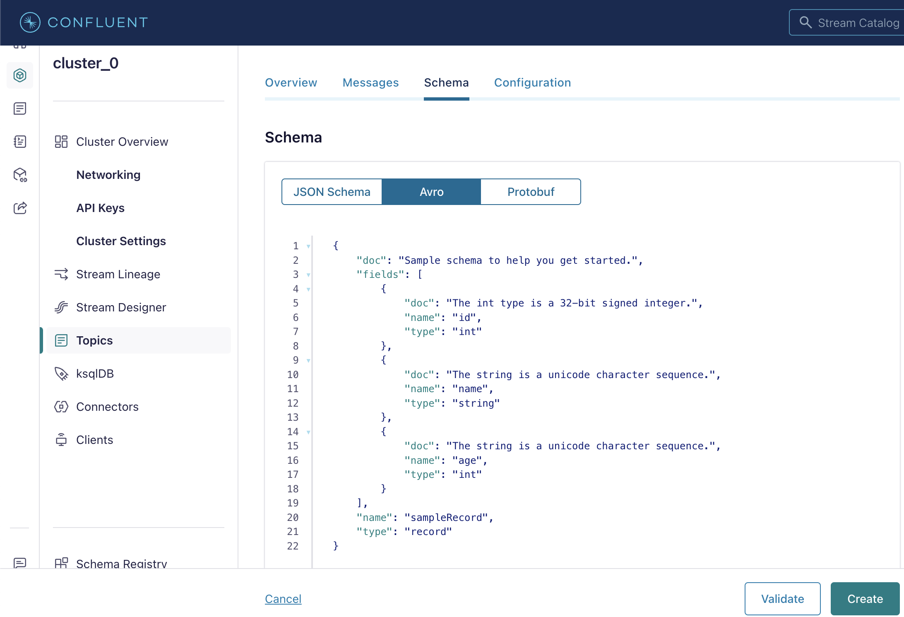
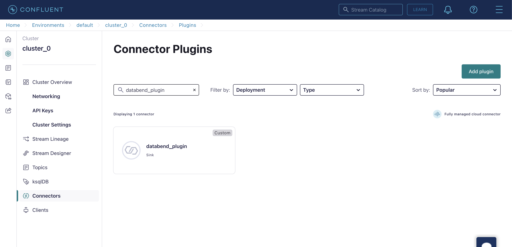
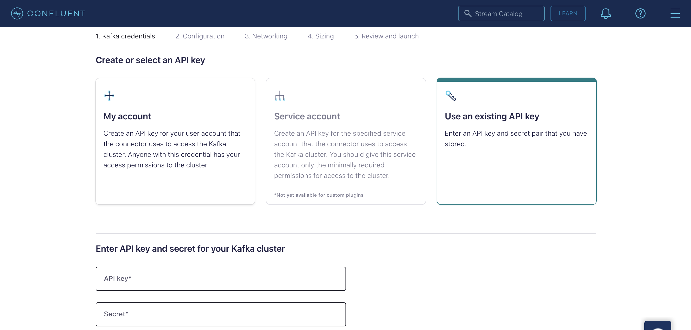
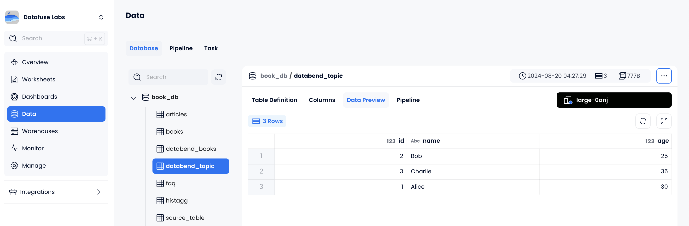

本教程将演示如何在 Confluent Cloud 中的 Kafka 与 Databend Cloud 之间搭建 Kafka Connect Sink 流水线，使用 [databend-kafka-connect](https://github.com/databendcloud/databend-kafka-connect) 插件生产消息并写入 Databend Cloud。

### 步骤 1：搭建 Kafka 环境

首先在 Confluent Cloud 中准备 Kafka 环境。

1. 注册并登录免费的 Confluent Cloud 账号。
2. 参考 [Confluent Quick Start](https://docs.confluent.io/cloud/current/get-started/index.html#step-1-create-a-ak-cluster-in-ccloud) 在默认环境中创建基础 Kafka 集群。
3. 按照 [Install Confluent CLI](https://docs.confluent.io/confluent-cli/current/install.html) 在本地安装 CLI，并登录：

```shell
confluent login --save
```

4. 使用 CLI 创建 API Key，并将其设置为当前 Key：

```shell
confluent kafka cluster list

confluent api-key create --resource lkc-jr57j2
...
confluent api-key use <your-api-key> --resource lkc-jr57j2
```

### 步骤 2：上传自定义 Connector 插件 

本步骤将 databend-kafka-connect Sink 插件上传到 Confluent Cloud。

1. 在 [GitHub Releases](https://github.com/databendcloud/databend-kafka-connect/releases) 下载最新版 databend-kafka-connect。
2. 在 Confluent Cloud 中依次点击 **Connectors** > **Add Connector** > **Add plugin**。
3. 填写以下信息并上传插件包：

| 参数 | 说明 |
|------|------|
| Connector plugin name | 例如 `databend_plugin` |
| Custom plugin description | 例如 `Kafka Connect sink connector for Databend` |
| Connector class | `com.databend.kafka.connect.DatabendSinkConnector` |
| Connector type | `Sink` |

### 步骤 3：创建 Kafka Topic

1. 在 Confluent Cloud 中点击 **Topics** > **Add topic**。
2. 设置 Topic 名称（如 `databend_topic`），继续下一步。
3. 选择 **Create a schema for message values**，点击 **Create Schema**。



4. 在 **Add new schema** 页面选择 **Avro** 标签页，并粘贴以下 Schema：

```json
{
    "doc": "Sample schema to help you get started.",
    "fields": [
        {
            "doc": "The int type is a 32-bit signed integer.",
            "name": "id",
            "type": "int"
        },
        {
            "doc": "The string is a unicode character sequence.",
            "name": "name",
            "type": "string"
        },
        {
            "doc": "The string is a unicode character sequence.",
            "name": "age",
            "type": "int"
        }
    ],
    "name": "sampleRecord",
    "type": "record"
}
```



### 步骤 4：添加 Connector

1. 在 Confluent Cloud 中点击 **Connectors** > **Add Connector**，选择刚上传的插件。



2. 在 **Kafka credentials** 步骤中选择 **Use an existing API key**，输入之前创建的 API key 与 secret。



3. 在 **Configuration** 步骤中切换到 **JSON** 标签页，粘贴以下配置并替换占位符：

```json
{
  "auto.create": "true",
  "auto.evolve": "true",
  "batch.size": "1",
  "confluent.custom.schema.registry.auto": "true",
  "connection.attempts": "3",
  "connection.backoff.ms": "10000",
  "connection.database": "<your-value>",
  "connection.password": "<your-value>",
  "connection.url": "jdbc:databend://<your-value>",
  "connection.user": "cloudapp",
  "errors.tolerance": "none",
  "insert.mode": "upsert",
  "key.converter": "org.apache.kafka.connect.storage.StringConverter",
  "max.retries": "10",
  "pk.fields": "id",
  "pk.mode": "record_value",
  "table.name.format": "<your-value>.${topic}",
  "topics": "databend_topic",
  "value.converter": "io.confluent.connect.avro.AvroConverter"
}
```

4. 在 **Networking** 步骤中填写 Databend Cloud Warehouse Endpoint，例如 `xxxxxxxxx--xxx.gw.aws-us-east-2.default.databend.com`。
5. 在 **Sizing** 步骤中设为 **1 task**。
6. 在 **Review and launch** 中为 Connector 命名，例如 `databend_connector`。

### 步骤 5：生产消息

1. 将用于 Topic 的 Schema 保存为本地 `schema.json` 文件。

```json
{
    "doc": "Sample schema to help you get started.",
    ...
}
```

2. 使用 Confluent CLI 执行 `confluent kafka topic produce <topic_name>`，向 Kafka Topic 发送消息：

```shell
confluent kafka topic produce databend_topic --value-format avro --schema schema.json
Successfully registered schema with ID "100001".
Starting Kafka Producer. Use Ctrl-C or Ctrl-D to exit.

{"id":1, "name":"Alice", "age":30}
{"id":2, "name":"Bob", "age":25}
{"id":3, "name":"Charlie", "age":35}
```

3. 在 Databend Cloud 中查看数据，确认写入成功：


