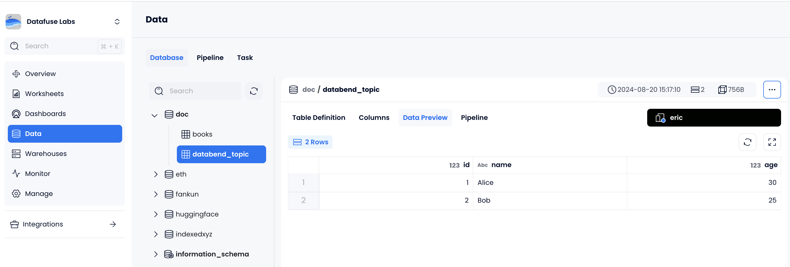

在本教程中，我们将指导您使用 Docker 设置 Kafka 环境，并通过 [bend-ingest-kafka](https://github.com/databendcloud/bend-ingest-kafka) 将消息从 Kafka 加载到 Databend Cloud。

### 步骤 1：设置 Kafka 环境

在端口 9092 上运行 Apache Kafka Docker 容器：

```shell
MacBook-Air:~ eric$ docker run -d \
>   --name kafka \
>   -p 9092:9092 \
>   apache/kafka:latest
Unable to find image 'apache/kafka:latest' locally
latest: Pulling from apache/kafka
690e87867337: Pull complete
5dddb19fae62: Pull complete
86caa4220d9f: Pull complete
7802c028acb4: Pull complete
16a3d1421c02: Pull complete
ab648c7f18ee: Pull complete
a917a90b7df6: Pull complete
4e446fc89158: Pull complete
f800ce0fc22f: Pull complete
a2e5e46262c3: Pull complete
Digest: sha256:c89f315cff967322c5d2021434b32271393cb193aa7ec1d43e97341924e57069
Status: Downloaded newer image for apache/kafka:latest
0261b8f3d5fde74f5f20340b58cb85d29d9b40ee4f48f1df2c41a68b616d22dc
```

### 步骤 2：创建主题并生成消息

1. 访问 Kafka 容器：

```shell
MacBook-Air:~ eric$ docker exec --workdir /opt/kafka/bin/ -it kafka sh
```

2. 创建一个名为 `test-topic` 的新 Kafka 主题：

```shell
/opt/kafka/bin $ ./kafka-topics.sh --bootstrap-server localhost:9092 --create --topic test-topic
Created topic test-topic.
```

3. 使用 Kafka 控制台生产者向 `test-topic` 生成消息：

```shell
/opt/kafka/bin $ ./kafka-console-producer.sh --bootstrap-server localhost:9092 --topic test-topic
```

4. 输入 JSON 格式的消息：

```json
{"id": 1, "name": "Alice", "age": 30}
{"id": 2, "name": "Bob", "age": 25}
```

5. 完成后使用 Ctrl+C 停止生产者。

### 步骤 3：在 Databend Cloud 中创建表

在 Databend Cloud 中创建目标表：

```sql
CREATE DATABASE doc;

CREATE    TABLE databend_topic (
          id INT NOT NULL,
          name VARCHAR NOT NULL,
          age INT NOT NULL
          ) ENGINE=FUSE;
```

### 步骤 4：安装并运行 bend-ingest-kafka

1. 通过运行以下命令安装 bend-ingest-kafka 工具：

```shell
go install  github.com/databendcloud/bend-ingest-kafka@latest
```

2. 运行以下命令将消息从 `test-topic` Kafka 主题加载到 Databend Cloud 中的目标表：

```shell
MacBook-Air:~ eric$ bend-ingest-kafka \
>   --kafka-bootstrap-servers="localhost:9092" \
>   --kafka-topic="test-topic" \
>   --databend-dsn="<your-dsn>" \
>   --databend-table="doc.databend_topic" \
>   --data-format="json"
INFO[0000] Starting worker worker-0
WARN[0072] Failed to read message from Kafka: context deadline exceeded  kafka_batch_reader=ReadBatch
2024/08/20 15:10:15 ingest 2 rows (1.225576 rows/s), 75 bytes (45.959100 bytes/s)
```

3. 在 Databend Cloud 中，验证数据是否已成功加载：

