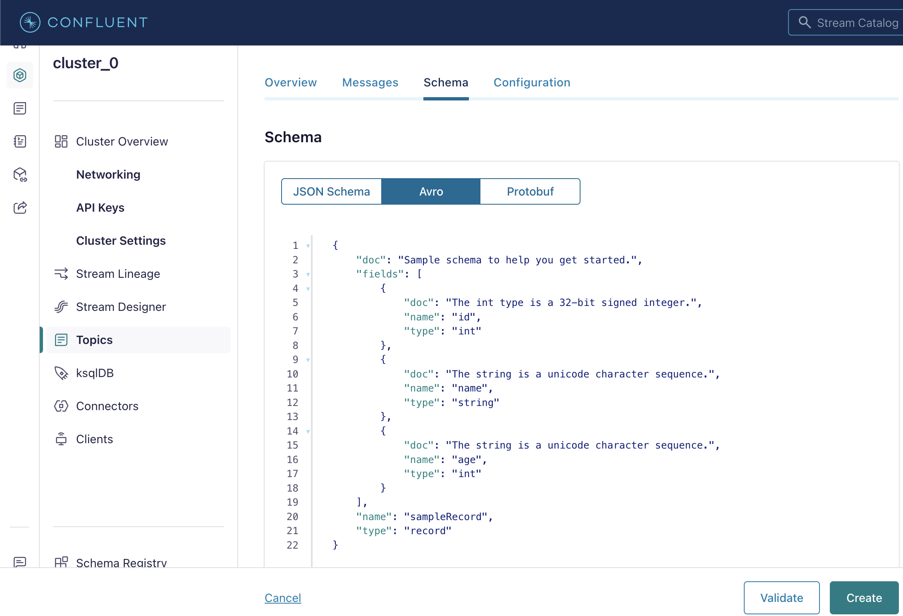
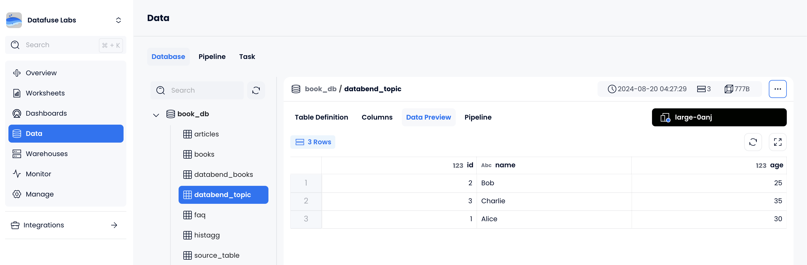

在本教程中，我们将使用 Kafka Connect sink connector 插件 [databend-kafka-connect](https://github.com/databendcloud/databend-kafka-connect) 建立 Confluent Cloud 中 Kafka 和 Databend Cloud 之间的连接。然后，我们将演示如何生成消息并将其加载到 Databend Cloud 中。

### Step 1: Setting up Kafka Environment

在开始之前，请确保您的 Kafka 环境已在 Confluent Cloud 中正确设置。

1. 注册一个免费的 Confluent Cloud 帐户。注册并创建帐户后，[登录](https://confluent.cloud/login)到您的 Confluent Cloud 帐户。

2. 按照 [Confluent Quick Start](https://docs.confluent.io/cloud/current/get-started/index.html#step-1-create-a-ak-cluster-in-ccloud) 在您的默认环境中创建并启动一个基本的 Kafka 集群。

3. 按照 [Install Confluent CLI](https://docs.confluent.io/confluent-cli/current/install.html) 指南在您的本地机器上安装 Confluent CLI。安装完成后，登录到您的 Confluent Cloud 帐户以连接到 Confluent Cloud：

```shell
confluent login --save
```

4. 使用 Confluent CLI 创建一个 API 密钥，并将其设置为活动的 API 密钥。

```shell
confluent kafka cluster list

  Current |     ID     |   Name    | Type  | Cloud |  Region   | Availability | Network | Status
----------+------------+-----------+-------+-------+-----------+--------------+---------+---------
  *       | lkc-jr57j2 | cluster_0 | BASIC | aws   | us-east-2 |              |         | UP

confluent api-key create --resource lkc-jr57j2
It may take a couple of minutes for the API key to be ready.
Save the API key and secret. The secret is not retrievable later.
+------------+------------------------------------------------------------------+
| API Key    | <your-api-key>                                                   |
| API Secret | <your-api-secret>                                                |
+------------+------------------------------------------------------------------+

confluent api-key use <your-api-key> --resource lkc-jr57j2
```

### Step 2: Add Custom Connector Plugin

在此步骤中，您将 Kafka Connect sink connector 插件 databend-kafka-connect 上传到 Confluent Cloud。

1. 从 [GitHub repository](https://github.com/databendcloud/databend-kafka-connect/releases) 下载最新版本的 databend-kafka-connect。

2. 在 Confluent Cloud 中，从导航菜单中，单击 **Connectors** > **Add Connector** > **Add plugin**。

3. 填写插件详细信息，如下所示，然后上传 databend-kafka-connect 包。

| Parameter                 | Description                                                |
| ------------------------- | ---------------------------------------------------------- |
| Connector plugin name     | 设置一个名称，例如 `databend_plugin`                       |
| Custom plugin description | 描述插件，例如 `Kafka Connect sink connector for Databend` |
| Connector class           | `com.databend.kafka.connect.DatabendSinkConnector`         |
| Connector type            | `Sink`                                                     |

### Step 3: Create a Kafka Topic

在此步骤中，您将在 Confluent Cloud 中创建一个 Kafka topic。

1. 在 Confluent Cloud 中，从导航菜单中，单击 **Topics** > **Add topic**。

2. 设置 topic 名称，例如 `databend_topic`，然后继续下一步。

3. 选择 **Create a schema for message values**，然后单击 **Create Schema**。


4. 在 **Add new schema** 页面上，选择 **Avro** 选项卡，然后复制以下 schema 并将其粘贴到编辑器中：

```json
{
  "doc": "Sample schema to help you get started.",
  "fields": [
    {
      "doc": "The int type is a 32-bit signed integer.",
      "name": "id",
      "type": "int"
    },
    {
      "doc": "The string is a unicode character sequence.",
      "name": "name",
      "type": "string"
    },
    {
      "doc": "The string is a unicode character sequence.",
      "name": "age",
      "type": "int"
    }
  ],
  "name": "sampleRecord",
  "type": "record"
}
```



### Step 4: Add a Connector

在此步骤中，您将设置一个连接到 Databend Cloud 的 connector。

1. 在 Confluent Cloud 中，从导航菜单中，单击 **Connectors** > **Add Connector**。搜索然后选择您上传的插件。


2. 在 **Kafka credentials** 步骤中，选择 **Use an existing API key**，然后输入您使用 Confluent CLI 创建的 API 密钥和 secret。


3. 在 **Configuration** 步骤中，选择 **JSON** 选项卡，然后复制以下配置并将其粘贴到编辑器中，将占位符替换为您的实际值：

```json
{
  "auto.create": "true",
  "auto.evolve": "true",
  "batch.size": "1",
  "confluent.custom.schema.registry.auto": "true",
  "connection.attempts": "3",
  "connection.backoff.ms": "10000",
  "connection.database": "<your-value>",
  "connection.password": "<your-value>",
  "connection.url": "jdbc:databend://<your-value>",
  "connection.user": "cloudapp",
  "errors.tolerance": "none",
  "insert.mode": "upsert",
  "key.converter": "org.apache.kafka.connect.storage.StringConverter",
  "max.retries": "10",
  "pk.fields": "id",
  "pk.mode": "record_value",
  "table.name.format": "<your-value>.${topic}",
  "topics": "databend_topic",
  "value.converter": "io.confluent.connect.avro.AvroConverter"
}
```

4. 在 **Networking** 步骤中，输入您的 Databend Cloud 计算集群 endpoint，例如 `xxxxxxxxx--xxx.gw.aws-us-east-2.default.databend.com`。

5. 在 **Sizing** 步骤中，将其设置为 **1 task**。

6. 在 **Review and launch** 步骤中，设置一个名称，例如 `databend_connector`。

### Step 5: Produce Messages

在此步骤中，您将使用 Confluent CLI 生成消息，并验证它们是否已加载到 Databend Cloud 中。

1. 在您的本地机器上，将用于创建 topic 的 schema 保存为 JSON 文件，例如 `schema.json`。

```json
{
  "doc": "Sample schema to help you get started.",
  "fields": [
    {
      "doc": "The int type is a 32-bit signed integer.",
      "name": "id",
      "type": "int"
    },
    {
      "doc": "The string is a unicode character sequence.",
      "name": "name",
      "type": "string"
    },
    {
      "doc": "The string is a unicode character sequence.",
      "name": "age",
      "type": "int"
    }
  ],
  "name": "sampleRecord",
  "type": "record"
}
```

2. 在 Confluent CLI 中，使用 `confluent kafka topic produce <topic_name>` 命令启动 Kafka producer，以将消息发送到您的 Kafka topic。

```shell
confluent kafka topic produce databend_topic --value-format avro --schema schema.json
Successfully registered schema with ID "100001".
Starting Kafka Producer. Use Ctrl-C or Ctrl-D to exit.

{"id":1, "name":"Alice", "age":30}
{"id":2, "name":"Bob", "age":25}
{"id":3, "name":"Charlie", "age":35}
```

3. 在 Databend Cloud 中，验证数据是否已成功加载：


