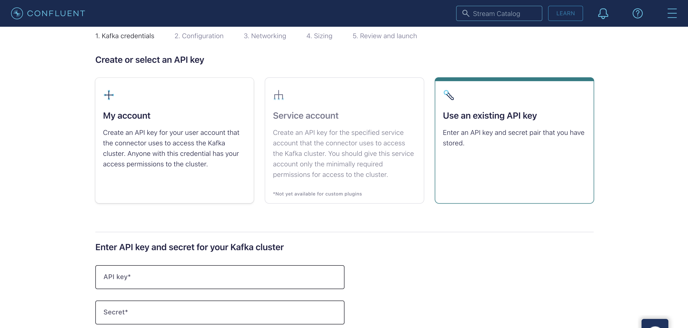

在本教程中，我们将通过Kafka Connect sink connector插件[databend-kafka-connect](https://github.com/databendcloud/databend-kafka-connect)，建立Confluent Cloud中的Kafka与Databend Cloud之间的连接。然后，我们将演示如何生成消息并将其加载到Databend Cloud中。

### 步骤1：设置Kafka环境

在开始之前，请确保您的Kafka环境已在Confluent Cloud中正确设置。

1. 注册一个免费的Confluent Cloud账户。注册并创建账户后，[登录](https://confluent.cloud/login)到您的Confluent Cloud账户。

2. 按照[Confluent快速入门](https://docs.confluent.io/cloud/current/get-started/index.html#step-1-create-a-ak-cluster-in-ccloud)创建并启动默认环境中的基本Kafka集群。

3. 按照[安装Confluent CLI](https://docs.confluent.io/confluent-cli/current/install.html)指南在本地机器上安装Confluent CLI。安装完成后，登录到您的Confluent Cloud账户以连接到Confluent Cloud：

```shell
confluent login --save
```

4. 使用Confluent CLI创建一个API密钥，并将其设置为活动API密钥。

```shell
confluent kafka cluster list

  Current |     ID     |   Name    | Type  | Cloud |  Region   | Availability | Network | Status
----------+------------+-----------+-------+-------+-----------+--------------+---------+---------
  *       | lkc-jr57j2 | cluster_0 | BASIC | aws   | us-east-2 |              |         | UP

confluent api-key create --resource lkc-jr57j2
It may take a couple of minutes for the API key to be ready.
Save the API key and secret. The secret is not retrievable later.
+------------+------------------------------------------------------------------+
| API Key    | <your-api-key>                                                   |
| API Secret | <your-api-secret>                                                |
+------------+------------------------------------------------------------------+

confluent api-key use <your-api-key> --resource lkc-jr57j2
```

### 步骤2：添加自定义连接器插件

在这一步中，您将上传Kafka Connect sink connector插件databend-kafka-connect到Confluent Cloud。

1. 从[GitHub仓库](https://github.com/databendcloud/databend-kafka-connect/releases)下载最新版本的databend-kafka-connect。

2. 在Confluent Cloud中，从导航菜单点击**连接器** > **添加连接器** > **添加插件**。

3. 填写插件详情如下，然后上传databend-kafka-connect包。

| 参数                      | 描述                                                                 |
|---------------------------|----------------------------------------------------------------------|
| 连接器插件名称            | 设置一个名称，例如，`databend_plugin`                                 |
| 自定义插件描述            | 描述插件，例如，`Kafka Connect sink connector for Databend`           |
| 连接器类                  | `com.databend.kafka.connect.DatabendSinkConnector`                    |
| 连接器类型                | `Sink`                                                               |

### 步骤3：创建Kafka主题

在这一步中，您将在Confluent Cloud中创建一个Kafka主题。

1. 在Confluent Cloud中，从导航菜单点击**主题** > **添加主题**。

2. 设置主题名称，例如，`databend_topic`，然后进入下一步。

3. 选择**为消息值创建模式**，然后点击**创建模式**。


4. 在**添加新模式**页面，选择**Avro**标签，然后复制并粘贴以下模式到编辑器：

```json
{
    "doc": "Sample schema to help you get started.",
    "fields": [
        {
            "doc": "The int type is a 32-bit signed integer.",
            "name": "id",
            "type": "int"
        },
        {
            "doc": "The string is a unicode character sequence.",
            "name": "name",
            "type": "string"
        },
        {
            "doc": "The string is a unicode character sequence.",
            "name": "age",
            "type": "int"
        }
    ],
    "name": "sampleRecord",
    "type": "record"
}
```


### 步骤4：添加连接器

在这一步中，您将设置一个连接器，该连接器连接到Databend Cloud。

1. 在Confluent Cloud中，从导航菜单点击**连接器** > **添加连接器**。搜索并选择您上传的插件。


2. 在**Kafka凭证**步骤中，选择**使用现有API密钥**，然后输入您使用Confluent CLI创建的API密钥和密钥。



3. 在**配置**步骤中，选择**JSON**标签，然后复制并粘贴以下配置到编辑器，将占位符替换为您的实际值：

```json
{
  "auto.create": "true",
  "auto.evolve": "true",
  "batch.size": "1",
  "confluent.custom.schema.registry.auto": "true",
  "connection.attempts": "3",
  "connection.backoff.ms": "10000",
  "connection.database": "<your-value>",
  "connection.password": "<your-value>",
  "connection.url": "jdbc:databend://<your-value>",
  "connection.user": "cloudapp",
  "errors.tolerance": "none",
  "insert.mode": "upsert",
  "key.converter": "org.apache.kafka.connect.storage.StringConverter",
  "max.retries": "10",
  "pk.fields": "id",
  "pk.mode": "record_value",
  "table.name.format": "<your-value>.${topic}",
  "topics": "databend_topic",
  "value.converter": "io.confluent.connect.avro.AvroConverter"
}
```

4. 在**网络**步骤中，输入您的Databend Cloud计算集群端点，例如`xxxxxxxxx--xxx.gw.aws-us-east-2.default.databend.com`。

5. 在**大小**步骤中，设置为**1个任务**。

6. 在**审查并启动**步骤中，设置一个名称，例如，`databend_connector`。

### 步骤5：生成消息

在这一步中，您将使用Confluent CLI生成消息，并验证它们是否已加载到Databend Cloud中。

1. 在您的本地机器上，将用于创建主题的模式保存为JSON文件，例如`schema.json`。

```json
{
    "doc": "Sample schema to help you get started.",
    "fields": [
        {
            "doc": "The int type is a 32-bit signed integer.",
            "name": "id",
            "type": "int"
        },
        {
            "doc": "The string is a unicode character sequence.",
            "name": "name",
            "type": "string"
        },
        {
            "doc": "The string is a unicode character sequence.",
            "name": "age",
            "type": "int"
        }
    ],
    "name": "sampleRecord",
    "type": "record"
}
```

2. 在Confluent CLI中，使用`confluent kafka topic produce <topic_name>`命令启动Kafka生产者，向您的Kafka主题发送消息。

```shell
confluent kafka topic produce databend_topic --value-format avro --schema schema.json
Successfully registered schema with ID "100001".
Starting Kafka Producer. Use Ctrl-C or Ctrl-D to exit.

{"id":1, "name":"Alice", "age":30}
{"id":2, "name":"Bob", "age":25}
{"id":3, "name":"Charlie", "age":35}
```

3. 在Databend Cloud中，验证数据是否已成功加载：

