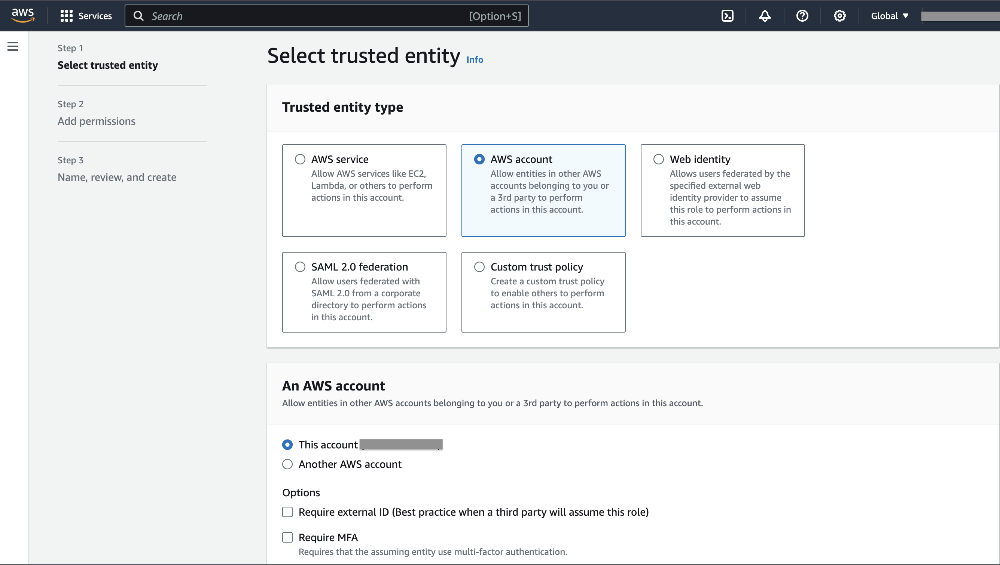
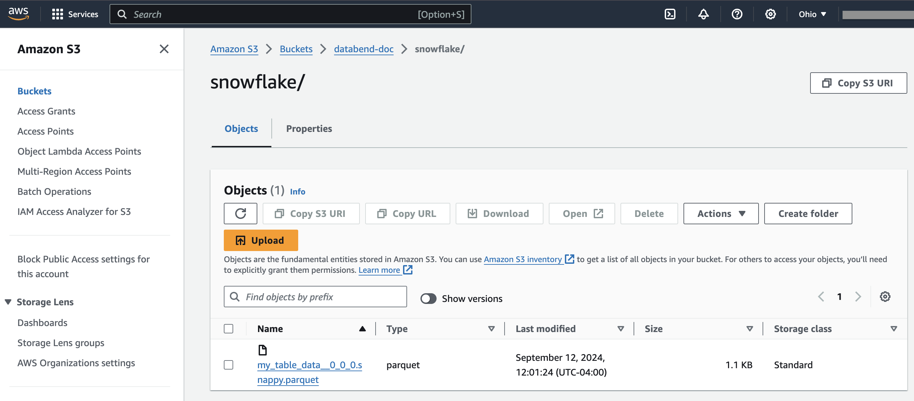

> **功能**: 全量加载

在本教程中，我们将引导你完成从 Snowflake 以 Parquet 格式导出数据到 Amazon S3 存储桶，然后将其加载到 Databend Cloud 的过程。

## 开始之前

在开始之前，请确保你已具备以下先决条件：

- **Amazon S3 存储桶**: 一个 S3 存储桶，用于存储导出的数据，以及上传文件所需的权限。[了解如何创建 S3 存储桶](https://docs.aws.amazon.com/AmazonS3/latest/userguide/create-bucket-overview.html)。在本教程中，我们使用 `s3://databend-doc/snowflake/` 作为暂存导出数据的位置。
- **AWS 凭证**: 具有访问 S3 存储桶足够权限的 AWS Access Key ID 和 Secret Access Key。[管理你的 AWS 凭证](https://docs.aws.amazon.com/general/latest/gr/aws-sec-cred-types.html#access-keys-and-secret-access-keys)。
- **管理 IAM 角色和策略的权限**: 确保你具有创建和管理 IAM 角色和策略的必要权限，这些权限是配置 Snowflake 和 Amazon S3 之间访问所必需的。[了解有关 IAM 角色和策略的信息](https://docs.aws.amazon.com/IAM/latest/UserGuide/id_roles.html)。

## 步骤 1：配置 Snowflake Storage Integration 以访问 Amazon S3

在此步骤中，我们将配置 Snowflake 以使用 IAM 角色访问 Amazon S3。首先，我们将创建一个 IAM 角色，然后使用该角色建立 Snowflake Storage Integration，以实现安全的数据访问。

1. 登录到 AWS 管理控制台，然后在 **IAM** > **Policies** 上创建一个策略，其中包含以下 JSON 代码：

```json
{
    "Version": "2012-10-17",
    "Statement": [
        {
            "Effect": "Allow",
            "Action": [
              "s3:PutObject",
              "s3:GetObject",
              "s3:GetObjectVersion",
              "s3:DeleteObject",
              "s3:DeleteObjectVersion"
            ],
            "Resource": "arn:aws:s3:::databend-doc/snowflake/*"
        },
        {
            "Effect": "Allow",
            "Action": [
                "s3:ListBucket",
                "s3:GetBucketLocation"
            ],
            "Resource": "arn:aws:s3:::databend-doc",
            "Condition": {
                "StringLike": {
                    "s3:prefix": [
                        "snowflake/*"
                    ]
                }
            }
        }
    ]
}
```

此策略适用于名为 `databend-doc` 的 S3 存储桶，特别是该存储桶中的 `snowflake` 文件夹。

- `s3:PutObject`、`s3:GetObject`、`s3:GetObjectVersion`、`s3:DeleteObject`、`s3:DeleteObjectVersion`: 允许对 snowflake 文件夹中的对象执行操作（例如，`s3://databend-doc/snowflake/`）。你可以在此文件夹中上传、读取和删除对象。
- `s3:ListBucket`、`s3:GetBucketLocation`: 允许列出 `databend-doc` 存储桶的内容并检索其位置。`Condition` 元素确保列表仅限于 `snowflake` 文件夹中的对象。

2. 在 **IAM** > **Roles** 上创建一个名为 `databend-doc-role` 的角色，并附加我们创建的策略。
    - 在创建角色的第一步中，为 **Trusted entity type** 选择 **AWS account**，为 **An AWS account** 选择 **This account (xxxxx)**。

    

    - 创建角色后，复制角色 ARN 并将其保存在安全的位置，例如 `arn:aws:iam::123456789012:role/databend-doc-role`。
    - 稍后，在获得 Snowflake 帐户的 IAM 用户 ARN 后，我们将更新角色的 **Trust Relationships**。

3. 在 Snowflake 中打开一个 SQL 工作表，并使用角色 ARN 创建一个名为 `my_s3_integration` 的存储集成。

```sql
CREATE OR REPLACE STORAGE INTEGRATION my_s3_integration
  TYPE = EXTERNAL_STAGE
  STORAGE_PROVIDER = 'S3'
  STORAGE_AWS_ROLE_ARN = 'arn:aws:iam::123456789012:role/databend-doc-role'
  STORAGE_ALLOWED_LOCATIONS = ('s3://databend-doc/snowflake/')
  ENABLED = TRUE; 
```

4. 显示存储集成详细信息，并在结果中获取 `STORAGE_AWS_IAM_USER_ARN` 属性的值，例如 `arn:aws:iam::123456789012:user/example`。我们将在下一步中使用此值来更新角色 `databend-doc-role` 的 **Trust Relationships**。

```sql
DESCRIBE INTEGRATION my_s3_integration;
```

5. 返回到 AWS 管理控制台，打开角色 `databend-doc-role`，然后导航到 **Trust relationships** > **Edit trust policy**。将以下代码复制到编辑器中：

```json
{
    "Version": "2012-10-17",
    "Statement": [
        {
            "Effect": "Allow",
            "Principal": {
                "AWS": "arn:aws:iam::123456789012:user/example"
            },
            "Action": "sts:AssumeRole"
        }
    ]
}
```

    ARN `arn:aws:iam::123456789012:user/example` 是我们在上一步中获得的 Snowflake 帐户的 IAM 用户 ARN。

## 步骤 2：准备数据并将其导出到 Amazon S3

1. 在 Snowflake 中使用 Snowflake 存储集成 `my_s3_integration` 创建一个外部 Stage：

```sql
CREATE OR REPLACE STAGE my_external_stage 
    URL = 's3://databend-doc/snowflake/' 
    STORAGE_INTEGRATION = my_s3_integration 
    FILE_FORMAT = (TYPE = 'PARQUET');
```

`URL = 's3://databend-doc/snowflake/'` 指定 S3 存储桶和将要暂存数据的文件夹。路径 `s3://databend-doc/snowflake/` 对应于 S3 存储桶 `databend-doc` 和该存储桶中的文件夹 `snowflake`。

2. 准备一些要导出的数据。

```sql
CREATE DATABASE doc;
USE DATABASE doc;

CREATE TABLE my_table (
    id INT,
    name STRING,
    age INT
);

INSERT INTO my_table (id, name, age) VALUES
(1, 'Alice', 30),
(2, 'Bob', 25),
(3, 'Charlie', 35);
```

3. 使用 COPY INTO 将表数据导出到外部 Stage：

```sql
COPY INTO @my_external_stage/my_table_data_
  FROM my_table
  FILE_FORMAT = (TYPE = 'PARQUET') HEADER=true;
```

如果现在打开存储桶 `databend-doc`，你应该会在 `snowflake` 文件夹中看到一个 Parquet 文件：



## 步骤 3：将数据加载到 Databend Cloud

1. 在 Databend Cloud 中创建目标表：

```sql
CREATE DATABASE doc;
USE DATABASE doc;

CREATE TABLE my_target_table (
    id INT,
    name STRING,
    age INT
);
```

2. 使用 [COPY INTO](/sql/sql-commands/dml/dml-copy-into-table) 加载存储桶中导出的数据：

```sql
COPY INTO my_target_table
FROM 's3://databend-doc/snowflake'
CONNECTION = (
    ACCESS_KEY_ID = '<your-access-key-id>',
    SECRET_ACCESS_KEY = '<your-secret-access-key>'
)
PATTERN = '.*[.]parquet'
FILE_FORMAT = (
    TYPE = 'PARQUET'
);
```

3. 验证加载的数据：

```sql
SELECT * FROM my_target_table;

┌──────────────────────────────────────────────────────┐
│        id       │       name       │       age       │
├─────────────────┼──────────────────┼─────────────────┤
│               1 │ Alice            │              30 │
│               2 │ Bob              │              25 │
│               3 │ Charlie          │              35 │
└──────────────────────────────────────────────────────┘
```