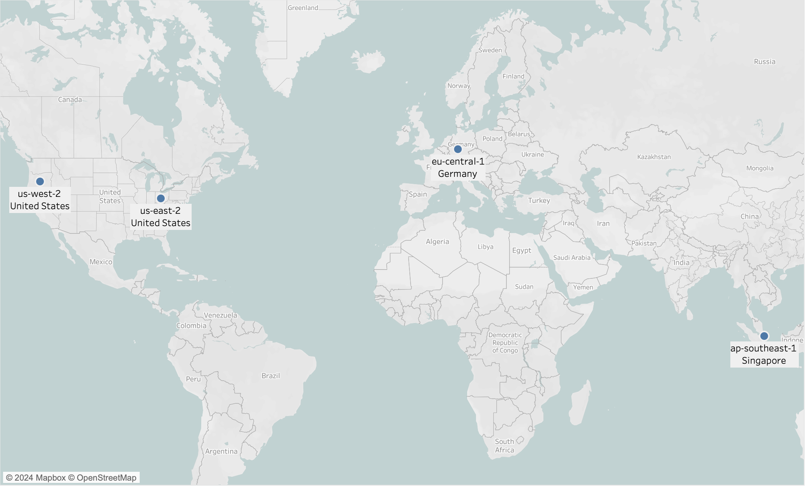

Databend Cloud is a cloud-native solution that currently supports [Amazon S3](https://aws.amazon.com/s3/) in the following regions:

:::note
Databend Cloud plans to expand its support for additional cloud platforms and regions. If your project requires support for a specific cloud platform or region, please click the **Contact Sales** button on the top right corner of the Databend Cloud homepage to get in touch with the Databend Cloud team.
:::

When you sign up for a Databend Cloud account, you will need to select a cloud platform and region. Once the account is successfully created, the selected cloud platform and region cannot be changed.