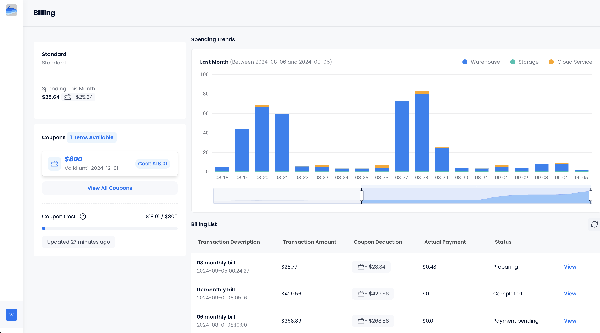

You can view the current month's consumption and billing history for your organization under **Manage** > **Billing**.

## Limiting Your Costs

For admin users, Databend Cloud offers the option to set a spending limit for their organization. This allows administrators to control the maximum amount of money spent on the platform. To do this, go to the homepage and click on **Activate Spending Limit**. On the next page, you can turn on the **Enable Spending Limit** button and specify the maximum monthly spending allowed for your organization.

:::note
The spending limit you set will apply to each calendar month. For instance, if you set a limit on August 10th, it will be in effect for the entire month of August, from the 1st to the 31st.
:::

When you set up a spending limit, you need to decide what action Databend Cloud should take when the limit is reached. Currently, there are two options:

- **Suspend Service**: Your warehouses will not function until the current month ends or you set a higher limit.

- **Send Notifications Only**: The administrators of your organization will receive email notifications as spending limits are approached. Your warehouses can continue to function properly.

For the "Send Notifications Only" option, Databend Cloud will send email notifications to administrators based on the following frequency cycle:

| Spending Range 	| Notification Frequency 	|
|----------------	|------------------------	|
| 80% - 90%      	| Every three days       	|
| 90% - 100%     	| Every three days       	|
| 100% or above     | Every three days       	|

## Granting Access to Finance Personnel

To facilitate the work of your finance team while ensuring data security, you can create a role named `billing` within Databend Cloud. This role will be specifically tailored to provide access only to billing-related information.

```sql
CREATE ROLE billing;
```

When inviting finance personnel to your organization, assign them this `billing` role. 


Once they log in to Databend Cloud, they will have restricted access, limited to only the billing page, with all other business-related pages hidden from view. This approach helps to safeguard sensitive data by restricting unnecessary access to other parts of your Databend Cloud environment.

