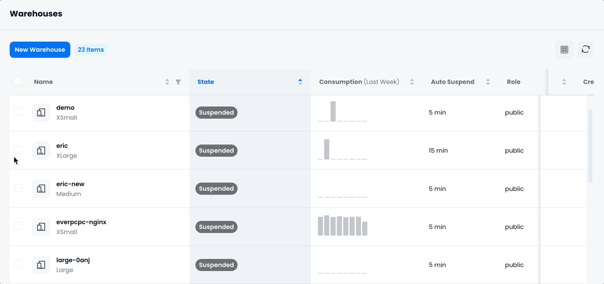
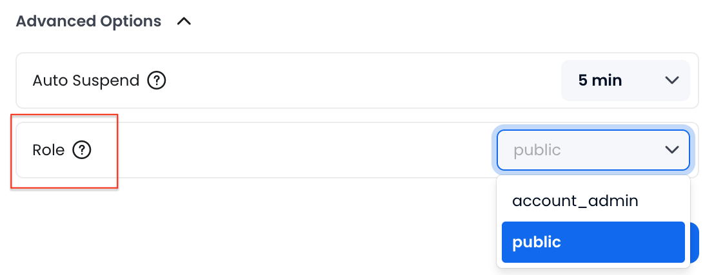
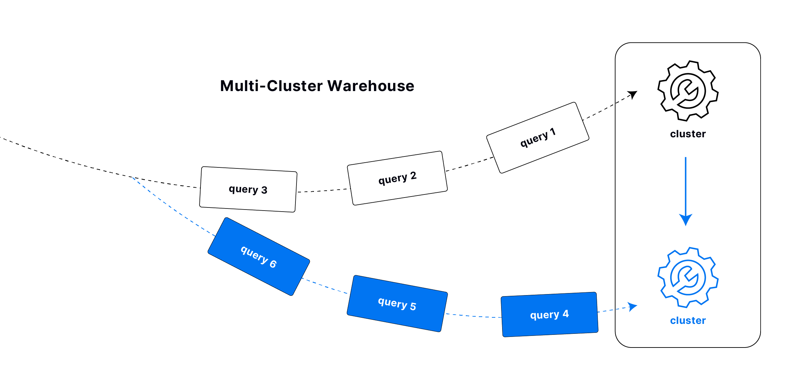
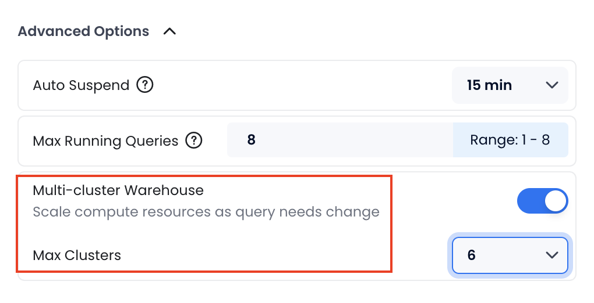

import PlaySVG from '@site/static/img/icon/play.svg'
import SuspendSVG from '@site/static/img/icon/suspend.svg'
import CheckboxSVG from '@site/static/img/icon/checkbox.svg'
import EllipsisSVG from '@site/static/img/icon/ellipsis.svg'
import { Button } from 'antd'

The warehouse is an essential component of Databend Cloud. A warehouse represents a set of compute resources including CPU, memory, and local caches. You must run a warehouse to perform SQL tasks such as:

- Querying data with the SELECT statement
- Modifying data with the INSERT, UPDATE, or DELETE statement
- Loading data into a table with the COPY INTO command

Running a warehouse incurs expenses. For more information, see [Warehouse Pricing](/guides/products/dc/pricing#warehouse-pricing).

## Warehouse Sizes

In Databend Cloud, warehouses are available in various sizes, each defined by the maximum number of concurrent queries it can handle. When creating a warehouse, you can choose from the following sizes:

| Size                  | Recommended Use Cases                                                                                                                            |
| --------------------- | ------------------------------------------------------------------------------------------------------------------------------------------------ |
| XSmall                | Best for simple tasks like testing or running light queries. Suitable for small datasets (around 50GB).                                          |
| Small                 | Great for running regular reports and moderate workloads. Suitable for medium-sized datasets (around 200GB).                                     |
| Medium                | Ideal for teams handling more complex queries and higher concurrency. Suitable for larger datasets (around 1TB).                                 |
| Large                 | Perfect for organizations running many concurrent queries. Suitable for large datasets (around 5TB).                                             |
| XLarge                | Built for enterprise-scale workloads with high concurrency. Suitable for very large datasets (over 10TB).                                        |
| Multi-Cluster Scaling | Automatically scales out and scales in to match your workload, providing the most cost-efficient way to improve concurrency based on your needs. |

To choose the appropriate warehouse size, Databend recommends starting with a smaller size. Smaller warehouses may take longer to execute SQL tasks compared to medium or large ones. If you find that query execution is taking too long (for example, several minutes), consider scaling up to a medium or large warehouse for faster results.

## Managing Warehouses {#managing}

An organization can have as many warehouses as needed. The **Warehouses** page displays all the warehouses in your organization and allows you to manage them. Please note that only `account_admin` can create or delete a warehouse.

### Suspending / Resuming Warehouses

A suspended warehouse does not consume any credits. You can manually suspend or resume a warehouse by clicking the <SuspendSVG/> or <PlaySVG/> button on the warehouse. However, a warehouse can automatically suspend or resume in the following scenarios:

- A warehouse can automatically suspend if there is no activity, based on its auto-suspend setting.
- When you select a suspended warehouse to perform a SQL task, the warehouse will automatically resume.

### Performing Bulk Operations

You can perform bulk operations on warehouses, including bulk restart, bulk suspend, bulk resume, and bulk delete. To do so, select the warehouses for bulk operations by checking the checkboxes <CheckboxSVG/> in the warehouse list, and then click the ellipse button <EllipsisSVG/> for the desired operation.



### Best Practices

To effectively manage your warehouses and ensure optimal performance and cost-efficiency, consider the following best practices. These guidelines will help you size, organize, and fine-tune your warehouses for various workloads and environments:

- **Choose the Right Size**

  - For **development & testing**, use smaller warehouses (XSmall, Small).
  - For **production**, opt for larger warehouses (Medium, Large, XLarge).

- **Separate Warehouses**

  - Use separate warehouses for **data loading** and **query execution**.
  - Create distinct warehouses for **development**, **testing**, and **production** environments.

- **Data Loading Tips**

  - Smaller warehouses (Small, Medium) are suitable for data loading.
  - Optimize file size and the number of files to enhance performance.

- **Optimize for Cost & Performance**

  - Avoid running simple queries like `SELECT 1` to minimize credit usage.
  - Use bulk loading (`COPY`) rather than individual `INSERT` statements.
  - Monitor long-running queries and optimize them to improve performance.

- **Auto-Suspend**

  - Enable auto-suspend to save credits when the warehouse is idle.

- **Disable Auto-Suspend for Frequent Queries**

  - Keep warehouses active for frequent or repetitive queries to maintain cache and avoid delays.

- **Use Auto-Scaling (Business & Dedicated Plans Only)**

  - Multi-cluster scaling automatically adjusts resources based on workload demand.

- **Monitor & Adjust Usage**
  - Regularly review warehouse usage and resize as needed to balance cost and performance.

## Warehouse Access Control

Databend Cloud allows you to manage warehouse access with role-based controls by assigning a specific role to a warehouse, so only users with that role can access the warehouse.

:::note
Warehouse access control is _not_ enabled out of the box. To enable it, go to **Support** > **Create New Ticket** and submit a request.
:::

To assign a role to a warehouse, select the desired role in the **Advanced Options** during the warehouse creation or modification process:



- The two [Built-in Roles](../../56-security/access-control/02-roles.md#built-in-roles) are available for selection, and you can also create additional roles using the [CREATE ROLE](/sql/sql-commands/ddl/user/user-create-role) command. For more information about Databend roles, see [Roles](../../56-security/access-control/02-roles.md).
- Warehouses without an assigned role default to the `public` role, allowing access to all users.
- You can grant a role to a user (Databend Cloud login email or SQL user) using the [GRANT](/sql/sql-commands/ddl/user/grant) command, or, alternatively, assign a role when inviting the user to your organization. For more information, see [Inviting New Members](00-organization.md#inviting-new-members). This example grants the role `manager` to the user with the email `name@example.com`, allowing access to any warehouse assigned to the `manager` role:

  ```sql title='Examples:'
  GRANT ROLE manager to 'name@example.com';
  ```

## Multi-Cluster Warehouses

A multi-cluster warehouse automatically adjusts compute resources by adding or removing clusters based on workload demand. It ensures high concurrency and performance while optimizing cost by scaling up or down as needed.

:::note
Multi-Cluster is only available for Databend Cloud users on the Business and Dedicated plans.
:::

### How it Works

By default, a warehouse consists of a single cluster of compute resources, which can handle a maximum number of concurrent queries depending on its size. When Multi-Cluster is enabled for a warehouse, it allows multiple clusters (as defined by the **Max Clusters** setting) to be dynamically added to handle workloads that exceed the capacity of a single cluster.

When the number of concurrent queries exceeds the capacity of your warehouse, an additional cluster is added to handle the extra load. If the demand continues to grow, more clusters are added one by one. As query demand decreases, clusters with no activity for longer than the **Auto Suspend** duration are automatically shut down.



### Enabling Multi-Cluster

You can enable Multi-Cluster for a warehouse when you create it and set the maximum number of clusters that the warehouse can scale up to. Please note that if Multi-Cluster is enabled for a warehouse, the **Auto Suspend** duration must be set to at least 15 minutes.



### Cost Calculation

Multi-Cluster Warehouses are billed based on the number of active clusters used during specific time intervals.

For example, for an XSmall Warehouse priced at $1 per hour, if one cluster is actively used from 13:00 to 14:00 and two clusters are actively used from 14:00 to 15:00, the total cost incurred from 13:00 to 15:00 is $3 ((1 cluster × 1 hour × $1) + (2 clusters × 1 hour × $1)).

## Connecting to a Warehouse {#connecting}

Connecting to a warehouse provides the compute resources required to run queries and analyze data within Databend Cloud. This connection is necessary when accessing Databend Cloud from your applications or SQL clients.

### Connection Methods

Databend Cloud supports multiple connection methods to meet your specific needs. For detailed connection instructions, see the [SQL Clients documentation](/guides/sql-clients/).

#### SQL Clients & Tools

| Client | Type | Best For | Key Features |
|--------|------|----------|------------|
| **[BendSQL](/guides/sql-clients/bendsql)** | Command Line | Developers, Scripts | Native CLI, Rich formatting, Multiple install options |
| **[DBeaver](/guides/sql-clients/jdbc)** | GUI Application | Data Analysis, Visual Queries | Built-in driver, Cross-platform, Query builder |

#### Developer Drivers

| Language | Driver | Use Case | Documentation |
|----------|--------|----------|---------------|
| **Go** | Golang Driver | Backend Applications | [Golang Guide](/guides/sql-clients/developers/golang) |
| **Python** | Python Connector | Data Science, Analytics | [Python Guide](/guides/sql-clients/developers/python) |
| **Node.js** | JavaScript Driver | Web Applications | [Node.js Guide](/guides/sql-clients/developers/nodejs) |
| **Java** | JDBC Driver | Enterprise Applications | [JDBC Guide](/guides/sql-clients/developers/jdbc) |
| **Rust** | Rust Driver | System Programming | [Rust Guide](/guides/sql-clients/developers/rust) |

### Obtaining Connection Information

To obtain the connection information for a warehouse:

1. Click **Connect** on the **Overview** page.
2. Select the database and warehouse you wish to connect to. The connection information will update based on your selection.
3. The connection details include a SQL user named `cloudapp` with a randomly generated password. Databend Cloud does not store this password. Be sure to copy and save it securely. If you forget the password, click **Reset** to generate a new one.

{/* LANG_IMAGE: 
   en=../../../../../static/img/documents/warehouses/databend_cloud_dsn.gif
   cn=../../../../../static/img/documents_cn/warehouses/databend_cloud_dsn.gif 
*/}


### Connection String Format

Databend Cloud automatically generates your connection string when you click **Connect**:

```
databend://<username>:<password>@<tenant>.gw.<region>.default.databend.com:443/<database>?warehouse=<warehouse_name>
```

Where:
- `<username>`: Default is `cloudapp`
- `<password>`: Click **Reset** to view or change
- `<tenant>`, `<region>`: Your account information (shown in the connection details)
- `<database>`: Selected database (shown in the connection details)
- `<warehouse_name>`: Selected warehouse (shown in the connection details)

### Creating SQL Users for Warehouse Access

Besides the default `cloudapp` user, you can create additional SQL users for better security and access control:

```sql
-- Create a new SQL user
CREATE USER warehouse_user1 IDENTIFIED BY 'StrongPassword123';

-- Grant ALL on database
-- This user can access all tables in the database
GRANT ALL ON my_database.* TO warehouse_user1;
```

For more details, see [CREATE USER](/sql/sql-commands/ddl/user/user-create-user) and [GRANT](/sql/sql-commands/ddl/user/grant) documentation.

### Connection Security

All connections to Databend Cloud warehouses use TLS encryption by default. For enterprise users requiring additional security, [AWS PrivateLink](/guides/sql-clients/privatelink) is available to establish private connections between your VPC and Databend Cloud.
