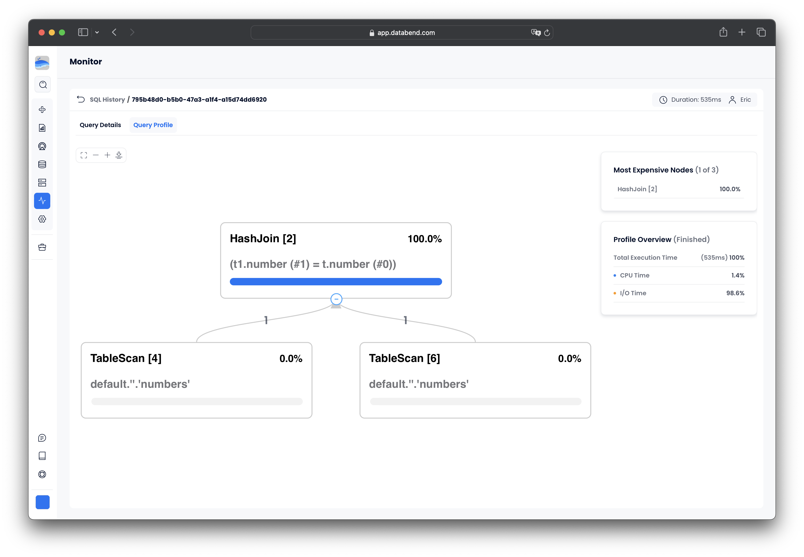
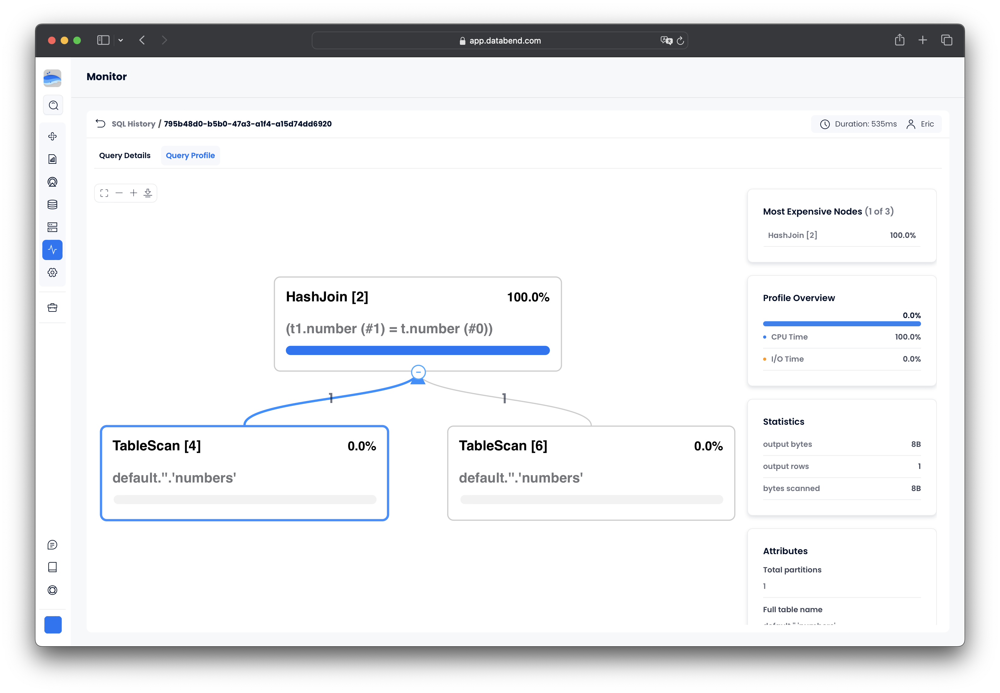

Databend Cloud provides monitoring functionality to help you gain a comprehensive understanding of your and your organization members' usage on the platform. To access the **Monitor** page, click **Monitor** in the sidebar menu on the homepage. The page includes the following tabs:

- [Metrics](#metrics)
- [SQL History](#sql-history)
- [Audit](#audit)

:::note
The **SQL History** and **Audit** tabs are visible only to admin members.
:::

## Metrics

The **Metrics** page presents charts that visually illustrate usage statistics for the following metrics, covering data from the past hour, day, or week:

- Storage Size
- SQL Query Count
- Session Connections
- Data Scanned / Written
- Warehouse Status
- Rows Scanned / Written

## SQL History

The **SQL History** page displays a list of SQL statements that have been executed by all users within your organization. By clicking **Filter** at the top of the list, you can filter records by multiple dimensions.

Clicking a record on the **SQL History** page reveals detailed information on how Databend Cloud executed the SQL statement, providing access to the following tabs:

- **Query Details**: Includes Query State (success or failure), Rows Scanned, Warehouse, Bytes Scanned, Start Time, End Time, and Handler Type.
- **Query Profile**: Illustrates how the SQL statement was executed. For more information, see [Understand Query Profile](#understand-query-profile).

### Query Profile

Query Profile refers to the graphical representation or visual breakdown of how a specific SQL statement is executed. It is essentially a graphical version of the [EXPLAIN](/sql/sql-commands/explain-cmds/explain) command, providing insights into the execution plan and performance details of the query. 

Here is an example of a query profile, comprising a set of three operator nodes in a hierarchical structure. When executing the SQL statement, Databend Cloud processes the nodes in a bottom-to-top sequence. The quantity and types of operator nodes a query profile contains depend on the specifics of your SQL statement. For the common operators and their statistical fields, see [Common Operators and Fields](/sql/sql-commands/explain-cmds/explain#common-operators-and-fields).

*Please note that the bracketed number in each node's title represents the node ID and does *not* indicate the execution step.* 

A query profile comes with a set of information panes that offer more details. The example above includes two information panes:

| Pane                 | Description                                                                                                                                                                                            |
|----------------------|--------------------------------------------------------------------------------------------------------------------------------------------------------------------------------------------------------|
| Most Expensive Nodes | Lists the nodes with the longest execution times.                                                                                                                                                      |
| Profile Overview     | Displays the percentage of time spent on CPU and I/O. Please note that if you select a node, this information pane shows the information specific to the node you select, rather than the whole query. |

If you click on the `TableScan [4]` node, you will notice that two additional information panes have been added to the right:

| Pane       | Description                                                                                                                         |
|------------|-------------------------------------------------------------------------------------------------------------------------------------|
| Statistics | Includes information such as scan progress, bytes scanned, percentage scanned from cache, partitions scanned, etc. |
| Attributes | Displays details specific to the node. The shown fields vary based on the functionality of the node.                                |

## Audit

The **Audit** page records the operation logs of all organization members, including the operation type, operation time, IP address, and the account of the operator. By clicking **Filter** at the top of the list, you can filter records by multiple dimensions.