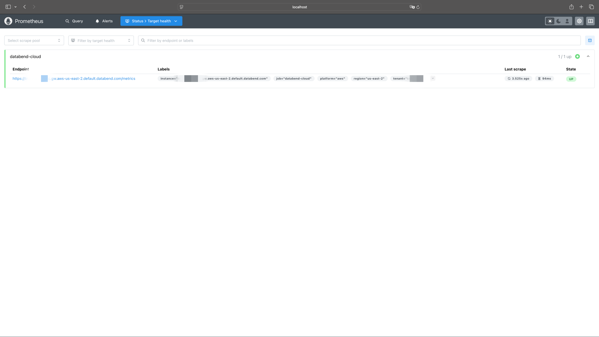
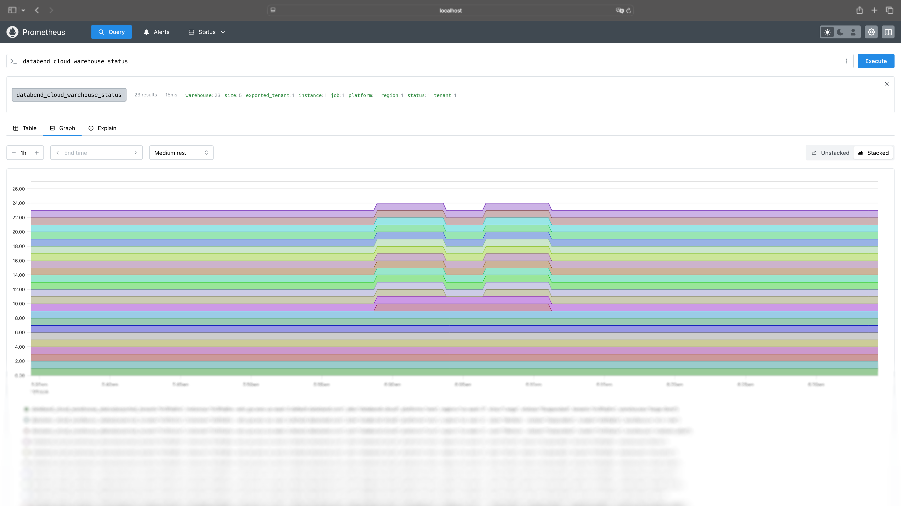

import StepsWrap from '@site/src/components/StepsWrap';
import StepContent from '@site/src/components/Steps/step-content';

[Prometheus](https://prometheus.io/) offers a robust solution for real-time monitoring, empowering you to track critical metrics and maintain system stability effectively. This topic guides you through the steps to integrate Prometheus with Databend Cloud and provides an overview of the available metrics.

:::note
Tracking metrics with Prometheus is only available for Databend Cloud users on the Business and Dedicated plans.
:::

## Integrating with Prometheus

Follow these steps to set up a Prometheus instance with Docker and integrate it with Databend Cloud:

<StepsWrap>
<StepContent number="1">

### Prerequisites

- To start tracking metrics, ensure that metrics are enabled for your Databend Cloud tenant. To enable this feature, submit a support ticket in Databend Cloud by navigating to **Support** > **Create New Ticket** and requesting metrics activation for your tenant.

- This procedure explains how to set up a Prometheus instance using Docker. Ensure that the Docker Engine is installed on your machine before proceeding.

</StepContent>
<StepContent number="2">

### Prepare a SQL User

Create a dedicated SQL user in Databend Cloud for Prometheus to access metrics. For example, you can create a SQL user named `metrics` with the password `metrics_password` using the following SQL statement:

```sql
CREATE USER metrics IDENTIFIED BY 'metrics_password';
```

</StepContent>
<StepContent number="3">

### Start Prometheus Using Docker

1. On your local machine, create a file named **prometheus.yml** to configure Prometheus for scraping metrics from Databend Cloud. Use the following template:

```yaml title='prometheus.yml'
scrape_configs:
  - job_name: databend-cloud
    scheme: https
    metrics_path: /metrics
    basic_auth:
      username: <USERNAME>
      password: <PASSWORD>
    scrape_interval: 10s
    scrape_timeout: 3s
    static_configs:
      - targets:
          - <TENANT_ENDPOINT>
        labels: # Optional
          tenant: <TENANT_ID>
          platform: <PLATFORM>
          region: <REGION>
```

| Placeholder         | Description                                      | Example                                           |
| ------------------- | ------------------------------------------------ | ------------------------------------------------- |
| `<USERNAME>`        | The username for the SQL user.                   | `metrics`                                         |
| `<PASSWORD>`        | The secure password for the SQL user.            | `metrics_password`                                |
| `<TENANT_ENDPOINT>` | The endpoint URL for your Databend Cloud tenant. | `tnxxxxxxx.gw.aws-us-east-2.default.databend.com` |
| `<TENANT_ID>`       | Your tenant's unique identifier.                 | `tnxxxxxxx`                                       |
| `<PLATFORM>`        | The cloud platform hosting the tenant.           | `aws`                                             |
| `<REGION>`          | The region where the tenant is hosted.           | `us-east-2`                                       |

2. Start Prometheus with the following command (replace `</path/to/prometheus.yml>` with the full path to your **prometheus.yml** file):

```bash
docker run -d \
  --name prometheus \
  -p 9090:9090 \
  -v </path/to/prometheus.yml>:/etc/prometheus/prometheus.yml \
  prom/prometheus
```

3. Open Prometheus in your browser at `http://localhost:9090`, navigate to **Status** > **Target health**, and confirm that the `databend-cloud` target is listed with a status of `UP`.



</StepContent>
</StepsWrap>

You're all set! You can now query your tenant metrics directly from Prometheus. For example, try querying `databend_cloud_warehouse_status`:



## Available Metrics List

Please note that all metrics are prefixed with `databend_cloud_`.

:::note
The metrics are in alpha state and may change over time. We recommend that you monitor the metrics closely and adjust your monitoring setup accordingly.
:::

### Query Metrics

The following is a list of query metrics available in Databend Cloud:

| Name                 | Type    | Labels           | Description                         |
| -------------------- | ------- | ---------------- | ----------------------------------- |
| query_count          | Counter | tenant,warehouse | Query counts made by clients        |
| query_errors         | Counter | tenant,warehouse | Query error counts made by clients  |
| query_request_bytes  | Counter | tenant,warehouse | Query request bytes from client     |
| query_response_bytes | Counter | tenant,warehouse | Query response bytes sent to client |

### Storage Metrics

The following is a list of storage metrics available in Databend Cloud:

| Name                          | Type  | Labels | Description                                           |
| ----------------------------- | ----- | ------ | ----------------------------------------------------- |
| storage_total_size            | Guage | tenant | Total size for backend object storage                 |
| storage_staged_size           | Guage | tenant | Total size for staged files on backend object storage |
| storage_table_compressed_size | Guage | tenant | Total size for current tables backend object storage  |
| storage_non_current_size      | Guage | tenant | Total size for non-current objects in backend storage |

### Warehouse Metrics

The following is a list of warehouse metrics available in Databend Cloud:

| Name                             | Type    | Labels                       | Description                                         |
| -------------------------------- | ------- | ---------------------------- | --------------------------------------------------- |
| warehouse_status                 | Guage   | tenant,warehouse,size,status | Flag for warehouse status (Suspended,Running, etc.) |
| warehouse_connections            | Guage   | tenant,warehouse             | Session Count currently                             |
| warehouse_queries_queued         | Guage   | tenant,warehouse             | Queries waiting in queue currently                  |
| warehouse_queries_running        | Guage   | tenant,warehouse             | Queries running currently                           |
| warehouse_queries_start_total    | Counter | tenant,warehouse             | Queries started total                               |
| warehouse_queries_failed_total   | Counter | tenant,warehouse             | Queries failed total                                |
| warehouse_queries_success_total  | Counter | tenant,warehouse             | Queries success total                               |
| warehouse_storage_requests_total | Counter | tenant,warehouse,scheme,op   | Requests count to backend storage                   |
| warehouse_storage_requests_bytes | Counter | tenant,warehouse,scheme,op   | Requests bytes from backend storage                 |
| warehouse_data_scan_rows         | Counter | tenant,warehouse             | Data rows scanned from backend storage              |
| warehouse_data_write_rows        | Counter | tenant,warehouse             | Data rows written to backend storage                |

### Task Metrics

The following is a list of task metrics available in Databend Cloud:

| Name                            | Type    | Labels          | Description                      |
| ------------------------------- | ------- | --------------- | -------------------------------- |
| task_scheduled_total            | Counter | tenant,task     | Total scheduled tasks            |
| task_query_requests_total       | Counter | tenant,task     | Query requests for tasks         |
| task_run_skipped_total          | Counter | tenant,task     | Skipped task runs                |
| task_accessor_requests_total    | Counter | tenant,function | Accessor requests for tasks      |
| task_notification_success_total | Counter | tenant          | Successful task notifications    |
| task_notification_errors_total  | Counter | tenant          | Task notification errors         |
| task_running_duration_seconds   | Counter | tenant,task     | Task running duration in seconds |
| task_running                    | Counter | tenant,task     | Running tasks                    |
| task_scheduled_timestamp        | Counter | tenant,task     | Scheduled task timestamps        |
