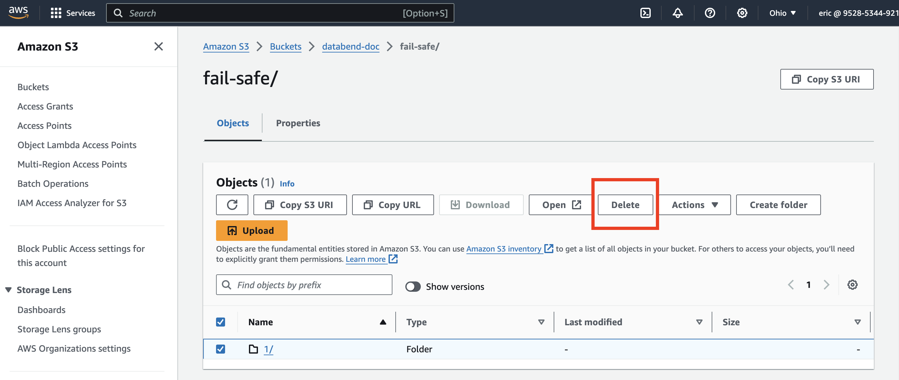

import IndexOverviewList from '@site/src/components/IndexOverviewList';
import EEFeature from '@site/src/components/EEFeature';

<EEFeature featureName='FAIL-SAFE'/>

Fail-Safe refers to mechanisms aimed at recovering lost or accidentally deleted data from object storage.

- Storage Compatibility: Currently, Fail-Safe supports only S3-compatible storage types.
- Bucket Versioning: For Fail-Safe to work, bucket versioning must be enabled. Note that data created before enabling versioning *cannot* be recovered using this method.

### Implementing Fail-Safe

Databend offers the [SYSTEM$FUSE_AMEND](/sql/sql-functions/table-functions/fuse-amend) table function to enable Fail-Safe recovery. This function lets you restore data from an S3-compatible storage bucket when bucket versioning is enabled.

### Usage Example

Below is a step-by-step example of using the [SYSTEM$FUSE_AMEND](/sql/sql-functions/table-functions/fuse-amend) function to recover a table's data from S3:

1. Enable versioning for the bucket `databend-doc`.


2. Create an external table, storing the table data in the `fail-safe` folder in the `databend-doc` bucket.

```sql
CREATE TABLE t(a INT) 
's3://databend-doc/fail-safe/' 
CONNECTION = (access_key_id ='<your-access-key-id>' secret_access_key ='<your-secret-accesskey>');

-- Insert sample data
INSERT INTO t VALUES (1), (2), (3);
```

If you open the `fail-safe` folder in the bucket now, you can see the data is already there:


3. Simulate data loss by deleting all the sub-folders and their files in the `fail-safe` folder.



4. Attempting to query the table after removal will result in an error:

```sql
SELECT * FROM t;

error: APIError: ResponseError with 3001: NotFound (persistent) at read, context: { uri: https://s3.us-east-2.amazonaws.com/databend-doc/fail-safe/1/1502/_b/3f84d636dc6c40508720d1cde20d4f3b_v2.parquet, response: Parts { status: 404, version: HTTP/1.1, headers: {"x-amz-request-id": "FYSJNZX1X16T91HN", "x-amz-id-2": "EI+NQjyRlSk8jlU64EASKodjvOkzuAlhZ1CYo0nIenzOH6DP7t6mMWh7raj4mUiOxW18NQesxmA=", "x-amz-delete-marker": "true", "x-amz-version-id": "ngecunzFP0pir0ysXlbR_eJafaTPl1oh", "content-type": "application/xml", "transfer-encoding": "chunked", "date": "Mon, 09 Sep 2024 02:01:57 GMT", "server": "AmazonS3"} }, service: s3, path: 1/1502/_b/3f84d636dc6c40508720d1cde20d4f3b_v2.parquet, range: 4-47 } => S3Error { code: "NoSuchKey", message: "The specified key does not exist.", resource: "", request_id: "FYSJNZX1X16T91HN" }
```

5. Recover the table data using system$fuse_amend:

```sql
CALL system$fuse_amend('default', 't');

-[ RECORD 1 ]-----------------------------------
result: Ok
```

6. Verify that the table data is back:

```sql
SELECT * FROM t;

┌─────────────────┐
│        a        │
├─────────────────┤
│               1 │
│               2 │
│               3 │
└─────────────────┘
```