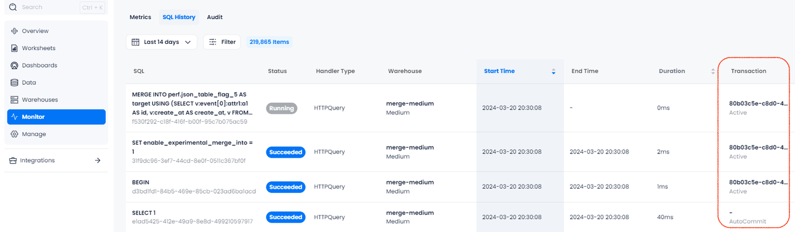

import FunctionDescription from '@site/src/components/FunctionDescription';

<FunctionDescription description="Introduced or updated: v1.2.371"/>

Starts a new transaction. BEGIN and [COMMIT](commit.md)/[ROLLBACK](rollback.md) must be used together to start and then either save or undo a transaction.

- Databend does *not* support nested transactions, so unmatched transaction statements will be ignored.

    ```sql title="Example:"
    BEGIN; -- Start a transaction

    MERGE INTO ... -- This statement belongs to the transaction

    BEGIN; -- Executing BEGIN within a transaction is ignored, no new transaction is started, no error is raised

    INSERT INTO ... -- This statement also belongs to the transaction

    COMMIT; -- End the transaction

    INSERT INTO ... -- This statement belongs to a single-statement transaction

    COMMIT; -- Executing COMMIT outside of a multi-statement transaction is ignored, no commit operation is performed, no error is raised

    BEGIN; -- Start another transaction
    ... 
    ```

- When a DDL statement is executed within a multi-statement transaction, it will commit the current multi-statement transaction and execute subsequent statements as single-statement transactions until another BEGIN is issued.

    ```sql title="Example:"
    BEGIN; -- Start a multi-statement transaction

    -- DML statements here are part of the current transaction
    INSERT INTO table_name (column1, column2) VALUES (value1, value2);

    -- Executing a DDL statement within the transaction
    CREATE TABLE new_table (column1 data_type, column2 data_type); 
    -- This will commit the current transaction

    -- Subsequent statements are executed as single-statement transactions
    UPDATE table_name SET column1 = value WHERE condition;

    BEGIN; -- Start a new multi-statement transaction

    -- New DML statements here are part of the new transaction
    DELETE FROM table_name WHERE condition;

    COMMIT; -- End the new transaction
    ```


## Syntax

```sql
BEGIN [ TRANSACTION ]
```

## Transaction IDs & Statuses

Databend automatically generates a transaction ID for each transaction. This ID allows users to identify which statements belong to the same transaction, facilitating issue troubleshooting.

If you're on Databend Cloud, you can find the transaction IDs on **Monitor** > **SQL History**:



In the **Transaction** column, you can also see the transaction status of SQL statements during execution:

| Transaction Status | Description                                                                                                                 |
|--------------------|-----------------------------------------------------------------------------------------------------------------------------|
| AutoCommit         | The statement is not part of a multi-statement transaction.                                                                 |
| Active             | The statement is part of a multi-statement transaction, and all statements preceding it within the transaction succeeded.   |
| Fail               | The statement is part of a multi-statement transaction, and at least one preceding statement within the transaction failed. |

## Examples

In this example, all three statements (INSERT, UPDATE, DELETE) are part of the same multi-statement transaction. They are executed as a single unit, and changes are committed together when COMMIT is issued.

```sql
-- Start by creating a table
CREATE TABLE employees (
    id INT,
    name VARCHAR(50),
    department VARCHAR(50)
);

-- Start a multi-statement transaction
BEGIN;

-- First statement in the transaction: Insert a new employee
INSERT INTO employees (id, name, department) VALUES (1, 'Alice', 'HR');

-- Second statement in the transaction: Insert another new employee
INSERT INTO employees (id, name, department) VALUES (2, 'Bob', 'Engineering');

-- Third statement in the transaction: Update the department of the first employee
UPDATE employees SET department = 'Finance' WHERE id = 1;

-- Commit all the changes
COMMIT;

-- Verify that the data in the table
SELECT * FROM employees;

┌───────────────────────────────────────────────────────┐
│        id       │       name       │    department    │
├─────────────────┼──────────────────┼──────────────────┤
│               1 │ Alice            │ Finance          │
│               2 │ Bob              │ Engineering      │
└───────────────────────────────────────────────────────┘
```

In this example, the ROLLBACK statement undoes all changes made during the transaction. As a result, the SELECT query at the end should show an empty employees table, confirming that no changes were committed.

```sql
-- Start by creating a table
CREATE TABLE employees (
    id INT,
    name VARCHAR(50),
    department VARCHAR(50)
);

-- Start a multi-statement transaction
BEGIN;

-- First statement in the transaction: Insert a new employee
INSERT INTO employees (id, name, department) VALUES (1, 'Alice', 'HR');

-- Second statement in the transaction: Insert another new employee
INSERT INTO employees (id, name, department) VALUES (2, 'Bob', 'Engineering');

-- Third statement in the transaction: Update the department of the first employee
UPDATE employees SET department = 'Finance' WHERE id = 1;

-- Rollback the transaction
ROLLBACK;

-- Verify that the table is empty
SELECT * FROM employees;
```