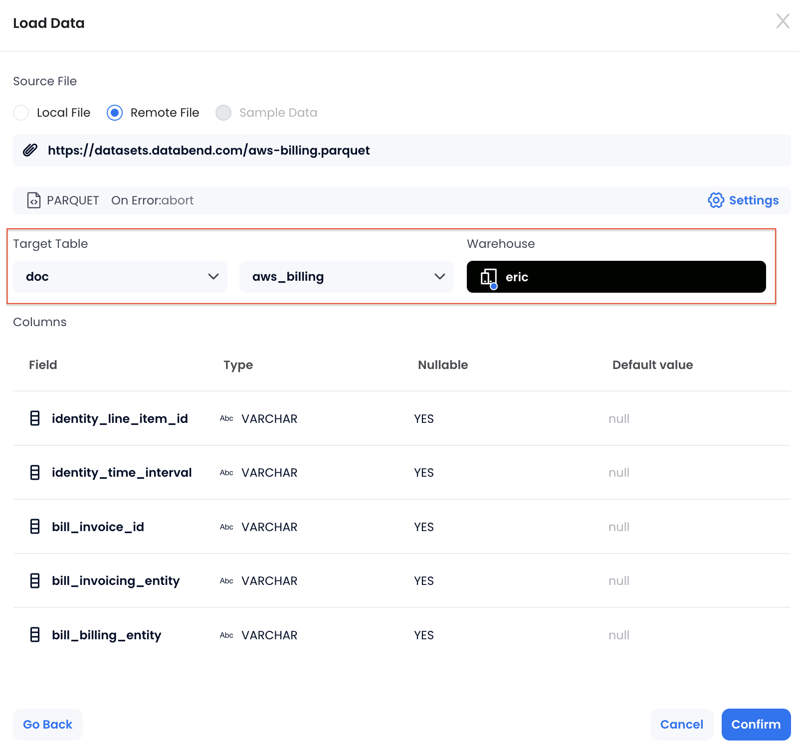

In this tutorial, we'll walk you through the process of importing AWS billing data and conducting cost analysis using SQL. You'll learn how to load the AWS billing data into Databend Cloud, query it to find key cost drivers, and gain insights into your AWS usage.

AWS billing data provides a comprehensive breakdown of your cloud service usage and associated costs, which can be exported in Parquet format directly from the AWS Cost and Usage Reports (CUR) service in the AWS Billing Console. In this tutorial, we'll be working with a sample dataset in Parquet format, available at [https://datasets.databend.com/aws-billing.parquet](https://datasets.databend.com/aws-billing.parquet). The dataset follows the CUR standards, which include fields like service names, usage types, and pricing details. For a complete schema reference, you can refer to the [AWS Cost and Usage Report Data Dictionary](https://docs.aws.amazon.com/cur/latest/userguide/data-dictionary.html).

## Step 1: Creating Target Table

Open a worksheet, create a database named `doc`, and then create a table named `aws_billing`:

```sql
CREATE DATABASE doc;

CREATE TABLE aws_billing (
    identity_line_item_id STRING,
    identity_time_interval STRING,
    bill_invoice_id STRING,
    bill_invoicing_entity STRING,
    bill_billing_entity STRING,
    bill_bill_type STRING,
    bill_payer_account_id STRING,
    bill_billing_period_start_date TIMESTAMP,
    bill_billing_period_end_date TIMESTAMP,
    line_item_usage_account_id STRING,
    line_item_line_item_type STRING,
    line_item_usage_start_date TIMESTAMP,
    line_item_usage_end_date TIMESTAMP,
    line_item_product_code STRING,
    line_item_usage_type STRING,
    line_item_operation STRING,
    line_item_availability_zone STRING,
    line_item_usage_amount DOUBLE,
    line_item_normalization_factor DOUBLE,
    line_item_normalized_usage_amount DOUBLE,
    line_item_currency_code STRING,
    line_item_unblended_rate STRING,
    line_item_unblended_cost DOUBLE,
    line_item_blended_rate STRING,
    line_item_blended_cost DOUBLE,
    line_item_line_item_description STRING,
    line_item_tax_type STRING,
    line_item_legal_entity STRING,
    product_product_name STRING,
    product_purchase_option STRING,
    product_availability STRING,
    product_availability_zone STRING,
    product_capacitystatus STRING,
    product_classicnetworkingsupport STRING,
    product_clock_speed STRING,
    product_content_type STRING,
    product_cputype STRING,
    product_current_generation STRING,
    product_database_engine STRING,
    product_dedicated_ebs_throughput STRING,
    product_deployment_option STRING,
    product_description STRING,
    product_durability STRING,
    product_ecu STRING,
    product_endpoint_type STRING,
    product_engine_code STRING,
    product_enhanced_networking_supported STRING,
    product_equivalentondemandsku STRING,
    product_fee_code STRING,
    product_fee_description STRING,
    product_from_location STRING,
    product_from_location_type STRING,
    product_from_region_code STRING,
    product_gpu STRING,
    product_gpu_memory STRING,
    product_group STRING,
    product_group_description STRING,
    product_instance_family STRING,
    product_instance_type STRING,
    product_instance_type_family STRING,
    product_intel_avx2_available STRING,
    product_intel_avx_available STRING,
    product_intel_turbo_available STRING,
    product_license_model STRING,
    product_location STRING,
    product_location_type STRING,
    product_logs_destination STRING,
    product_marketoption STRING,
    product_max_iops_burst_performance STRING,
    product_max_iopsvolume STRING,
    product_max_throughputvolume STRING,
    product_max_volume_size STRING,
    product_memory STRING,
    product_memory_gib STRING,
    product_memorytype STRING,
    product_message_delivery_frequency STRING,
    product_message_delivery_order STRING,
    product_min_volume_size STRING,
    product_network_performance STRING,
    product_normalization_size_factor STRING,
    product_operating_system STRING,
    product_operation STRING,
    product_origin STRING,
    product_physical_processor STRING,
    product_pre_installed_sw STRING,
    product_pricingplan STRING,
    product_processor_architecture STRING,
    product_processor_features STRING,
    product_product_family STRING,
    product_provider STRING,
    product_purchaseterm STRING,
    product_queue_type STRING,
    product_recipient STRING,
    product_region STRING,
    product_region_code STRING,
    product_request_type STRING,
    product_servicecode STRING,
    product_servicename STRING,
    product_sku STRING,
    product_snapshotarchivefeetype STRING,
    product_storage STRING,
    product_storage_class STRING,
    product_storage_media STRING,
    product_storage_type STRING,
    product_subservice STRING,
    product_tenancy STRING,
    product_tiertype STRING,
    product_to_location STRING,
    product_to_location_type STRING,
    product_to_region_code STRING,
    product_transfer_type STRING,
    product_type STRING,
    product_usagetype STRING,
    product_vcpu STRING,
    product_version STRING,
    product_volume_api_name STRING,
    product_volume_type STRING,
    product_vpcnetworkingsupport STRING,
    pricing_lease_contract_length STRING,
    pricing_offering_class STRING,
    pricing_purchase_option STRING,
    pricing_rate_code STRING,
    pricing_rate_id STRING,
    pricing_currency STRING,
    pricing_public_on_demand_cost DOUBLE,
    pricing_public_on_demand_rate STRING,
    pricing_term STRING,
    pricing_unit STRING,
    reservation_amortized_upfront_cost_for_usage DOUBLE,
    reservation_amortized_upfront_fee_for_billing_period DOUBLE,
    reservation_effective_cost DOUBLE,
    reservation_end_time STRING,
    reservation_modification_status STRING,
    reservation_normalized_units_per_reservation STRING,
    reservation_number_of_reservations STRING,
    reservation_recurring_fee_for_usage DOUBLE,
    reservation_start_time STRING,
    reservation_subscription_id STRING,
    reservation_total_reserved_normalized_units STRING,
    reservation_total_reserved_units STRING,
    reservation_units_per_reservation STRING,
    reservation_unused_amortized_upfront_fee_for_billing_period DOUBLE,
    reservation_unused_normalized_unit_quantity DOUBLE,
    reservation_unused_quantity DOUBLE,
    reservation_unused_recurring_fee DOUBLE,
    reservation_upfront_value DOUBLE,
    savings_plan_total_commitment_to_date DOUBLE,
    savings_plan_savings_plan_a_r_n STRING,
    savings_plan_savings_plan_rate DOUBLE,
    savings_plan_used_commitment DOUBLE,
    savings_plan_savings_plan_effective_cost DOUBLE,
    savings_plan_amortized_upfront_commitment_for_billing_period DOUBLE,
    savings_plan_recurring_commitment_for_billing_period DOUBLE,
    savings_plan_start_time STRING,
    savings_plan_end_time STRING,
    savings_plan_offering_type STRING,
    savings_plan_payment_option STRING,
    savings_plan_purchase_term STRING,
    savings_plan_region STRING
);
```

## Step 2: Loading AWS Billing Dataset

In this step, you'll load the AWS billing dataset into Databend Cloud with just a few clicks.

1. In Databend Cloud, select **Overview** > **Load Data** to launch the data loading wizard.

2. Select to load data into **An existing table**, then choose **Load from a URL** and enter the dataset URL: `https://datasets.databend.com/aws-billing.parquet`.


3. Select the database and table you created, then choose a warehouse.



4. Click **Confirm** to start the data loading.

## Step 3: Analyzing Costs with SQL

Now that your billing data is in place, you're ready to use SQL queries to analyze the AWS billing information. This step provides some examples to shed light on your spending and help you uncover key insights.

The following query identifies the most expensive services you’ve used:

```sql
SELECT
    product_servicename AS Service,
    SUM(line_item_blended_cost) AS Total_Cost
FROM aws_billing
WHERE
    line_item_blended_cost IS NOT NULL
    AND product_servicename != ''
GROUP BY product_servicename
ORDER BY Total_Cost DESC
LIMIT 25;
```

The following query identifies the most expensive AWS EC2 resources:

```sql
SELECT
    line_item_line_item_description,
    SUM(line_item_blended_cost) AS Total_Cost
FROM aws_billing
WHERE
    product_servicename = 'Amazon Elastic Compute Cloud'
    AND line_item_blended_cost IS NOT NULL
    AND identity_line_item_id != ''
GROUP BY line_item_line_item_description
ORDER BY Total_Cost DESC
LIMIT 25;
```

The following query identifies the most expensive S3 buckets:

```sql
SELECT
    line_item_line_item_description,
    SUM(line_item_blended_cost) AS Cost    
FROM aws_billing
WHERE
    line_item_product_code = 'AmazonS3'
    AND line_item_line_item_description != ''
GROUP BY line_item_line_item_description
ORDER BY Cost DESC
LIMIT 25;
```

The following query identifies the top 25 most expensive regions based on blended costs:

```sql
SELECT
    product_region AS Region,
    SUM(line_item_blended_cost) AS Total_Cost
FROM aws_billing
WHERE
    line_item_blended_cost IS NOT NULL
    AND product_region IS NOT NULL
GROUP BY product_region
ORDER BY Total_Cost DESC
LIMIT 25;
```

The following query categorizes your costs into Reserved Instances and On-Demand instances to help you understand how each type contributes to your total spending:

```sql
SELECT
    CASE
        WHEN reservation_amortized_upfront_cost_for_usage IS NOT NULL THEN 'Reserved Instances'
        ELSE 'On-Demand'
    END AS Instance_Type,
    SUM(line_item_blended_cost) AS Total_Cost
FROM aws_billing
WHERE
    line_item_blended_cost IS NOT NULL
GROUP BY Instance_Type
ORDER BY Total_Cost DESC;
```
