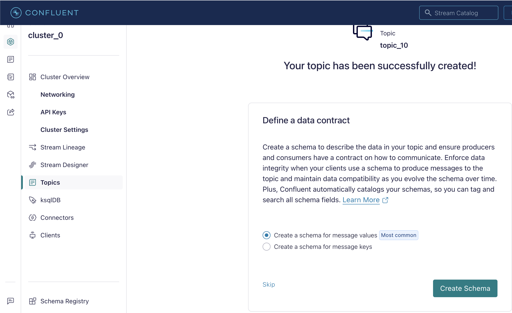
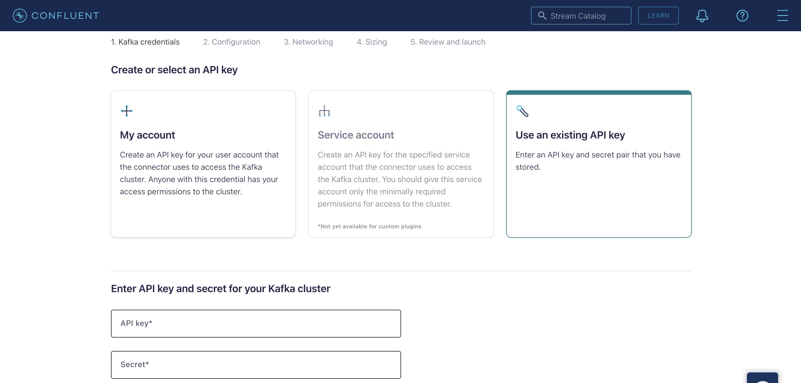

In this tutorial, we'll establish a connection between Kafka in Confluent Cloud and Databend Cloud using the Kafka Connect sink connector plugin, [databend-kafka-connect](https://github.com/databendcloud/databend-kafka-connect). Then, we'll demonstrate how to produce messages and load them into Databend Cloud.

### Step 1: Setting up Kafka Environment

Before you begin, ensure that your Kafka environment is properly set up in Confluent Cloud.

1. Sign up for a free Confluent Cloud account. Once you've registered and created your account, [sign in](https://confluent.cloud/login) to your Confluent Cloud account.

2. Follow the [Confluent Quick Start](https://docs.confluent.io/cloud/current/get-started/index.html#step-1-create-a-ak-cluster-in-ccloud) create and launch a basic Kafka cluster inside your default environment.

3. Follow the [Install Confluent CLI](https://docs.confluent.io/confluent-cli/current/install.html) guide to install the Confluent CLI on your local machine. After installation, log in to your Confluent Cloud account to connect to Confluent Cloud:

```shell
confluent login --save
```

4. Create an API key using the Confluent CLI and set it as the active API key.

```shell
confluent kafka cluster list

  Current |     ID     |   Name    | Type  | Cloud |  Region   | Availability | Network | Status
----------+------------+-----------+-------+-------+-----------+--------------+---------+---------
  *       | lkc-jr57j2 | cluster_0 | BASIC | aws   | us-east-2 |              |         | UP

confluent api-key create --resource lkc-jr57j2
It may take a couple of minutes for the API key to be ready.
Save the API key and secret. The secret is not retrievable later.
+------------+------------------------------------------------------------------+
| API Key    | <your-api-key>                                                   |
| API Secret | <your-api-secret>                                                |
+------------+------------------------------------------------------------------+

confluent api-key use <your-api-key> --resource lkc-jr57j2
```

### Step 2: Add Custom Connector Plugin 

In this step, you will upload the Kafka Connect sink connector plugin, databend-kafka-connect, to Confluent Cloud.

1. Download the latest version of databend-kafka-connect from the [GitHub repository](https://github.com/databendcloud/databend-kafka-connect/releases).

2. In Confluent Cloud, from the navigation menu, click **Connectors** > **Add Connector** > **Add plugin**.

3. Fill the plugin details as follows then upload the databend-kafka-connect package. 

| Parameter                 | Description                                                                   |
|---------------------------|-------------------------------------------------------------------------------|
| Connector plugin name     | Set a name, for example, `databend_plugin`                                    |
| Custom plugin description | Describe the plugin, for example, `Kafka Connect sink connector for Databend` |
| Connector class           | `com.databend.kafka.connect.DatabendSinkConnector`                            |
| Connector type            | `Sink`                                                                        |

### Step 3: Create a Kafka Topic

In this step, you will create a Kafka topic in Confluent Cloud. 

1. In Confluent Cloud, from the navigation menu, click **Topics** > **Add topic**.

2. Set the topic name, for example, `databend_topic`, then proceed to the next step.

3. Select **Create a schema for message values**, then click **Create Schema**.



4. On the **Add new schema** page, select the **Avro** tab, then copy and paste the following schema to the editor:

```json
{
    "doc": "Sample schema to help you get started.",
    "fields": [
        {
            "doc": "The int type is a 32-bit signed integer.",
            "name": "id",
            "type": "int"
        },
        {
            "doc": "The string is a unicode character sequence.",
            "name": "name",
            "type": "string"
        },
        {
            "doc": "The string is a unicode character sequence.",
            "name": "age",
            "type": "int"
        }
    ],
    "name": "sampleRecord",
    "type": "record"
}
```


### Step 4: Add a Connector

In this step, you will set up a connector that connects to Databend Cloud.

1. In Confluent Cloud, from the navigation menu, click **Connectors** > **Add Connector**. Search for then select the plugin you uploaded. 


2. In the **Kafka credentials** step, select **Use an existing API key**, then enter the API key & secret you created with the Confluent CLI. 



3. In the **Configuration** step, select the **JSON** tab, then copy and paste the following configuration to the editor, replacing the placeholders with your actual values:

```json
{
  "auto.create": "true",
  "auto.evolve": "true",
  "batch.size": "1",
  "confluent.custom.schema.registry.auto": "true",
  "connection.attempts": "3",
  "connection.backoff.ms": "10000",
  "connection.database": "<your-value>",
  "connection.password": "<your-value>",
  "connection.url": "jdbc:databend://<your-value>",
  "connection.user": "cloudapp",
  "errors.tolerance": "none",
  "insert.mode": "upsert",
  "key.converter": "org.apache.kafka.connect.storage.StringConverter",
  "max.retries": "10",
  "pk.fields": "id",
  "pk.mode": "record_value",
  "table.name.format": "<your-value>.${topic}",
  "topics": "databend_topic",
  "value.converter": "io.confluent.connect.avro.AvroConverter"
}
```

4. In the **Networking** step, enter your Databend Cloud warehouse endpoint, such as `xxxxxxxxx--xxx.gw.aws-us-east-2.default.databend.com`.

5. In the **Sizing** step, set it to **1 task**. 

6. In the **Review and launch** step, set a name, for example, `databend_connector`.

### Step 5: Produce Messages

In this step, you will produce messages using the Confluent CLI and verify that they are loaded into Databend Cloud.

1. On your local machine, save the schema used to create the topic as a JSON file, such as `schema.json`.

```json
{
    "doc": "Sample schema to help you get started.",
    "fields": [
        {
            "doc": "The int type is a 32-bit signed integer.",
            "name": "id",
            "type": "int"
        },
        {
            "doc": "The string is a unicode character sequence.",
            "name": "name",
            "type": "string"
        },
        {
            "doc": "The string is a unicode character sequence.",
            "name": "age",
            "type": "int"
        }
    ],
    "name": "sampleRecord",
    "type": "record"
}
```

2. In the Confluent CLI, start the Kafka producer with the `confluent kafka topic produce <topic_name>` command to send messages to your Kafka topic.

```shell
confluent kafka topic produce databend_topic --value-format avro --schema schema.json
Successfully registered schema with ID "100001".
Starting Kafka Producer. Use Ctrl-C or Ctrl-D to exit.

{"id":1, "name":"Alice", "age":30}
{"id":2, "name":"Bob", "age":25}
{"id":3, "name":"Charlie", "age":35}
```

3. In Databend Cloud, verify that the data has been successfully loaded:

