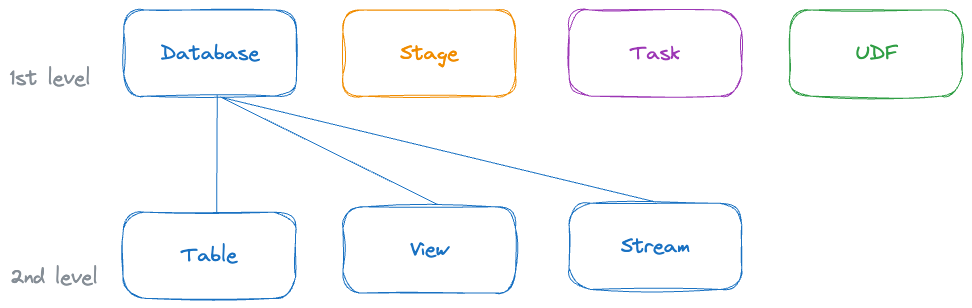

### Q1: What are Databend's primary objects, hierarchy, and associated privileges?

The diagram illustrates the hierarchical structure of Databend objects across two levels. Fine-grained privileges and ownership are designed for each type of object, providing flexibility. For more information, see [Access Control](../56-security/access-control.md).



### Q2: How do I create a table in Databend?

Use the [CREATE TABLE](/sql/sql-commands/ddl/table/ddl-create-table) command to create a table in Databend:

```sql title='Example:'
CREATE TABLE example (
-- Except for DECIMAL, no need to specify field length.
  c1 INT,
  c2 VARCHAR,
  c3 DATETIME,
  c4 DECIMAL(20, 2),
  c5 BITMAP,
  c6 TUPLE (FLOAT, FLOAT)
);
```

### Q3: What are the data type mappings across Databend, MySQL, and Oracle?

This table provides an outline of the mapping of data types between Databend, MySQL, and Oracle.

| Databend      | MySQL     | Oracle       |
|---------------|-----------|--------------|
| TINYINT       | TINYINT   | NUMBER(3,0)  |
| SMALLINT      | SMALLINT  | NUMBER(5,0)  |
| INT           | INT       | NUMBER(10,0) |
| BIGINT        | BIGINT    | NUMBER(19,0) |
| FLOAT         | FLOAT     | FLOAT        |
| DOUBLE        | DOUBLE    | FLOAT(24)    |
| DECIMAL       | DECIMAL   | FLOAT(24)    |
| DATE          | DATE      | DATE         |
| TIMESTAMP     | TIMESTAMP | NUMBER       |
| DATETIME      | DATETIME  | DATE         |
| YEAR          | INT       | NUMBER       |
| VARCHAR       | VARCHAR   | VARCHAR2     |
| VARCHAR       | CHAR      | CHAR         |
| VARBINARY     | VARBINARY | RAW, BLOB    |
| VARCHAR       | VARCHAR   | VARCHAR2     |
| VARCHAR       | VARCHAR   | RAW, CBLOB   |
| VARBINARY     | VARBINARY | RAW, BLOB    |
| VARCHAR       | VARCHAR   | RAW, CBLOB   |
| VARCHAR       | VARCHAR   | VARCHAR2     |
| VARCHAR       | VARCHAR   | VARCHAR2     |
| ARRAY         | N/A       | N/A          |
| BOOLEAN       | N/A       | N/A          |
| TUPLE         | N/A       | N/A          |
| MAP           | N/A       | N/A          |
| JSON, VARIANT | JSON      | JSON         |
| BITMAP        | N/A       | N/A          |
