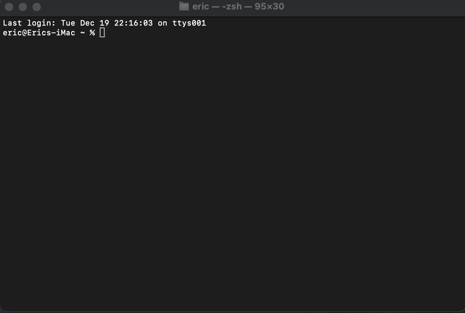
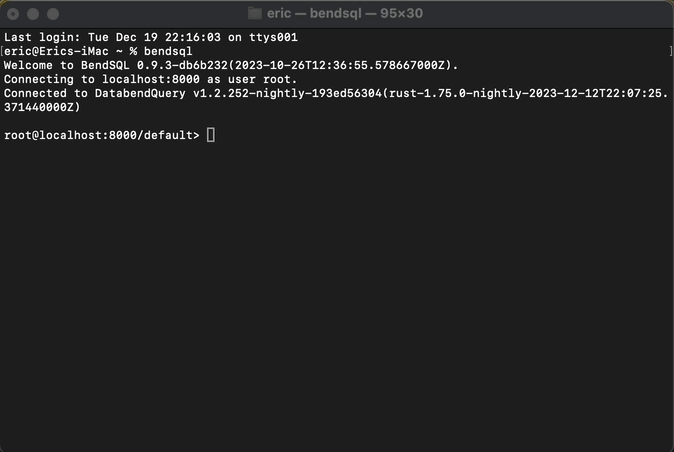
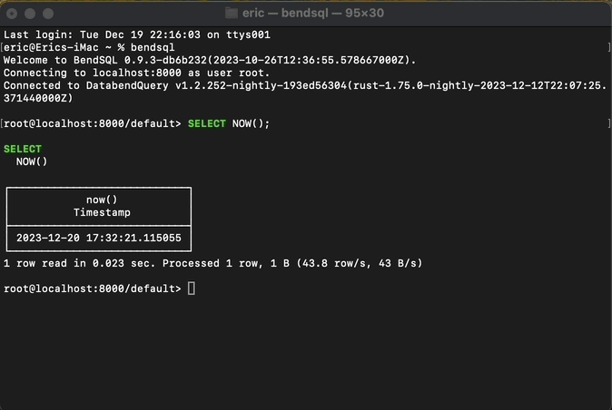

import StepsWrap from '@site/src/components/StepsWrap';
import StepContent from '@site/src/components/Steps/step-content';

In this tutorial, we will guide you through the process of connecting to Databend using BendSQL as the user `root`.

<StepsWrap>
<StepContent number="1" title="Before You Start">

- Ensure that BendSQL is installed on your machine. See [Installing BendSQL](index.md#installing-bendsql) for instructions on how to install BendSQL using various package managers.
- Ensure that you have a local Databend instance ready for testing. See [Docker and Local Deployments](../../10-deploy/05-deploying-local.md) for detailed instructions. 
- In this tutorial, you will use the `root` account to connect to Databend. During deployment, uncomment the following lines in the [databend-query.toml](https://github.com/datafuselabs/databend/blob/main/scripts/distribution/configs/databend-query.toml) configuration file to select this account:

    ```sql title="databend-query.toml"
    [[query.users]]
    name = "root"
    auth_type = "no_password"
    ```

</StepContent>
<StepContent number="2" title="Open BendSQL">

To launch BendSQL, enter `bendsql` directly into your terminal or command prompt.

:::note
The command `bendsql` launches and connects BendSQL to the local Databend at 127.0.0.1 using the `root` user without requiring a password. If you wish to connect to a local Databend with a different user, such as 'eric' with the password 'abc123', use the command `bendsql --user eric --password abc123`. To view all available arguments and their default values, type `bendsql --help`.
:::




</StepContent>
<StepContent number="3" title="Execute Queries">

Once connected, you can execute SQL queries in the BendSQL shell. For instance, let's type `SELECT NOW();` to return the current time:



</StepContent>
<StepContent number="4" title="Quit BendSQL">

To quit BendSQL, type `quit`.



</StepContent>
</StepsWrap>

<!--

Step 3: Execute Queries

Once connected, you can execute SQL queries in the BendSQL shell. For instance, let's run a simple query to show databases:

sql
Copy code
SHOW DATABASES;
Explore more SQL commands and interact with your Databend cluster using BendSQL.

Step 4: Disconnect

When you're done, disconnect from the Databend cluster using:

sql
Copy code
DISCONNECT;
-->