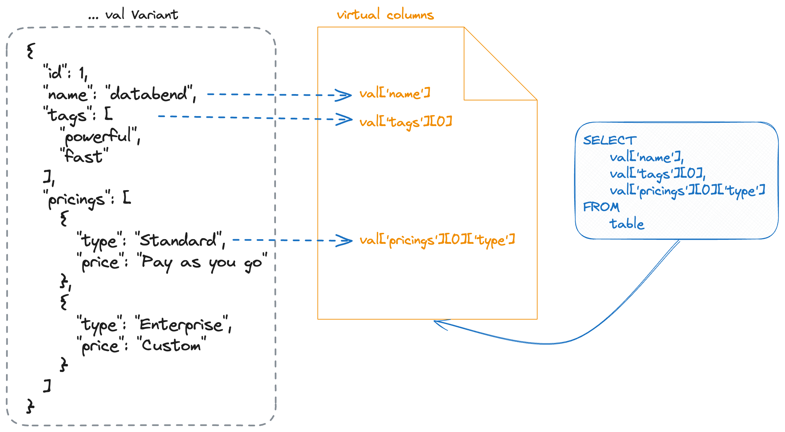

import IndexOverviewList from '@site/src/components/IndexOverviewList';
import EEFeature from '@site/src/components/EEFeature';

<EEFeature featureName='VIRTUAL COLUMN'/>

A virtual column is a construct formed by extracting nested fields within [Variant](../../../00-sql-reference/10-data-types/43-data-type-variant.md) data and storing that data in separate storage files. Virtual columns offer enhanced efficiency in querying Variant data, with the following key benefits:

- **Accelerated Query Processing**: Virtual columns streamline the querying process by eliminating the need to traverse the entire nested structure to locate the desired data. Direct data retrieval from virtual columns parallels the process of accessing regular columns, resulting in a significant acceleration of query execution.

- **Reduced Memory Usage**: Variant data often includes numerous internal fields, and reading all of them can lead to substantial memory consumption. By transitioning to reading virtual columns, there is a notable reduction in memory usage, mitigating the risk of potential memory overflows.



### Managing Virtual Columns

Databend provides the following commands to manage virtual columns:

<IndexOverviewList />

### Usage Example

This example demonstrates the practical use of virtual columns and their impact on query execution:

```sql
-- Create a table named 'test' with columns 'id' and 'val' of type Variant.
CREATE TABLE test(id int, val variant);

-- Insert a sample record into the 'test' table with Variant data.
INSERT INTO
  test
VALUES
  (
    1,
    '{"id":1,"name":"databend","tags":["powerful","fast"],"pricings":[{"type":"Standard","price":"Pay as you go"},{"type":"Enterprise","price":"Custom"}]}'
  );

-- Create virtual columns for specific elements in the 'val' column.
CREATE VIRTUAL COLUMN (
  val ['name'],                 -- Extract the 'name' field.
  val ['tags'] [0],             -- Extract the first element in the 'tags' array.
  val ['pricings'] [0] ['type'] -- Extract the 'type' field from the first pricing in the 'pricings' array.
) FOR test;

-- Explain the query execution plan for selecting specific fields from the table.
EXPLAIN
SELECT
  val ['name'],
  val ['tags'] [0],
  val ['pricings'] [0] ['type']
FROM
  test;

-[ EXPLAIN ]-----------------------------------
TableScan
├── table: default.default.test
├── output columns: [val['name'] (#2), val['tags'][0] (#3), val['pricings'][0]['type'] (#4)]
├── read rows: 1
├── read bytes: 203
├── partitions total: 1
├── partitions scanned: 1
├── pruning stats: [segments: <range pruning: 1 to 1>, blocks: <range pruning: 1 to 1, bloom pruning: 0 to 0>]
├── push downs: [filters: [], limit: NONE, virtual_columns: [val['name'], val['pricings'][0]['type'], val['tags'][0]]]
└── estimated rows: 1.00

-- Explain the query execution plan for selecting only the 'name' field from the table.
EXPLAIN
SELECT
  val ['name']
FROM
  test;

-[ EXPLAIN ]-----------------------------------
TableScan
├── table: default.default.test
├── output columns: [val['name'] (#2)]
├── read rows: 1
├── read bytes: 203
├── partitions total: 1
├── partitions scanned: 1
├── pruning stats: [segments: <range pruning: 1 to 1>, blocks: <range pruning: 1 to 1, bloom pruning: 0 to 0>]
├── push downs: [filters: [], limit: NONE, virtual_columns: [val['name']]]
└── estimated rows: 1.00

-- Display all the virtual columns defined in the system.
SHOW VIRTUAL COLUMNS;

┌─────────────────────────────────────────────────────────────────────────────┐
│ database │  table │                     virtual_columns                     │
├──────────┼────────┼─────────────────────────────────────────────────────────┤
│ default  │ test   │ val['name'], val['pricings'][0]['type'], val['tags'][0] │
└─────────────────────────────────────────────────────────────────────────────┘

-- Drop the virtual columns associated with the 'test' table.
DROP VIRTUAL COLUMN FOR test;
```