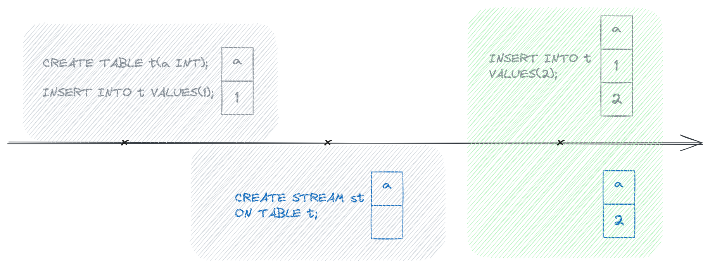
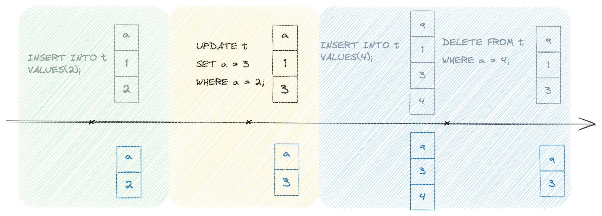
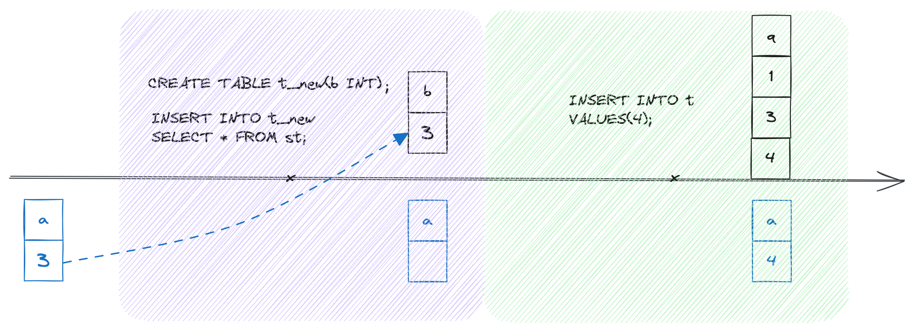

import IndexOverviewList from '@site/src/components/IndexOverviewList';
import EEFeature from '@site/src/components/EEFeature';

<EEFeature featureName='STREAM'/>

A stream in Databend is a dynamic and real-time representation of changes to a table. Streams are created to capture and track modifications to the associated table, allowing continuous consumption and analysis of data changes as they occur.

### How Stream Works

This section provides a quick example illustrating what a stream looks like and how it works. Let's say we have a table named 't' and we create a stream to capture the table changes. Once created, the stream starts to capture data changes to the table:



**A Databend stream currently operates in an Append-only mode**. In this mode, the stream exclusively contains data insertion records, reflecting the latest changes to the table. Although data updates and deletions are not directly recorded, they are still taken into account. 

For example, if a row is added and later updated with new values, the stream records the insertion along with the updated values. Similarly, if a row is added and subsequently deleted, the stream reflects these changes accordingly:



**A stream can be consumed by DML (Data Manipulation Language) operations**. After consumption, the stream contains no data but can continue to capture new changes, if any.




### Stream Metadata

**A stream does not store any data for a table**. After creating a stream for a table, Databend adds the following hidden columns to the table as change tracking metadata. These columns are designed to dynamically capture and reflect alterations induced by DML operations.

| Column                | Description                                                                       |
|-----------------------|-----------------------------------------------------------------------------------|
| _origin_version       | Identifies the table version in which this row was initially created.             |
| _origin_block_id      | Identifies the block ID to which this row belonged previously.                    |
| _origin_block_row_num | Identifies the row number within the block to which this row belonged previously. |

To display the values of these columns, use the SELECT statement:

```sql title='Example:'
SELECT *, _origin_version, _origin_block_id, _origin_block_row_num 
FROM test_stream;

┌───────────────────────────────────────────────────────────────────────────────────────┐
│        a        │  _origin_version │     _origin_block_id     │ _origin_block_row_num │
├─────────────────┼──────────────────┼──────────────────────────┼───────────────────────┤
│               1 │             NULL │ NULL                     │                  NULL │
│               3 │             3740 │ NULL                     │                  NULL │
└───────────────────────────────────────────────────────────────────────────────────────┘
```

### Managing Streams

To manage streams in Databend, use the following commands:

<IndexOverviewList />

### Usage Examples

In this example, we assume the management of a book collection through the `books_total` table.

```sql
-- Create a table to store all books information
CREATE TABLE books_total (
    book_id INT,
    title VARCHAR(255),
    author VARCHAR(255),
    publication_year INT
);

-- Insert records for the year 2022
INSERT INTO books_total VALUES
    (1, 'The Song of Achilles', 'Madeline Miller', 2022),
    (2, 'The Night Circus', 'Erin Morgenstern', 2022),
    (3, 'Where the Red Fern Grows', 'Wilson Rawls', 2022);
```

As we transition into 2023, we introduce the `books_stream_2023` stream to capture changes at the year's onset.

```sql
CREATE STREAM books_stream_2023 ON TABLE books_total;
```

New books for 2023 are seamlessly added to `books_total`, and the stream efficiently records these additions.

```sql
INSERT INTO books_total VALUES
    (4, 'The Silent Patient', 'Alex Michaelides', 2023),
    (5, 'Where the Crawdads Sing', 'Delia Owens', 2023),
    (6, 'Educated', 'Tara Westover', 2023);

-- View the changes in the stream for the year 2023
SELECT * FROM books_stream_2023;

┌─────────────────────────────────────────────────────────────────────────────────┐
│     book_id     │          title          │      author      │ publication_year │
├─────────────────┼─────────────────────────┼──────────────────┼──────────────────┤
│               4 │ The Silent Patient      │ Alex Michaelides │             2023 │
│               5 │ Where the Crawdads Sing │ Delia Owens      │             2023 │
│               6 │ Educated                │ Tara Westover    │             2023 │
└─────────────────────────────────────────────────────────────────────────────────┘
```

Subsequently, you can create another table `books_2023`to store information specifically for the year 2023 and populate it with the stream data.

```sql
CREATE TABLE books_2023 (
    book_id INT,
    title VARCHAR(255),
    author VARCHAR(255),
    publication_year INT
);

INSERT INTO books_2023
SELECT * FROM books_stream_2023;
```
